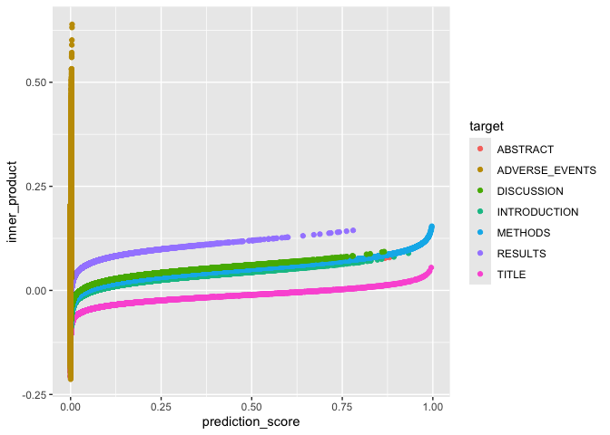

Training Classifiers on Section Heading Patterns
================
Bob
2024-04-22

## Using logistic regression classifier coefficients as a search vector

This document demonstrates two main points:

- Logistic regression text classifiers are useful and practical.
  - Semantic vectors make powerful predictive features features.
  - Labels mined from section headings can be used to identify a wide
    variety of topics.
- Model scoring can be framed as vector search.
  - We get the same ranking by vector similarity to the coefficient
    vector as we do from scoring with the model.

Database search is a theme here in that sometimes mined labels might
only apply to a small fraction of documents, so we need to search
through a large database of examples to find enough cases to supply
training and test sets.

``` r
library(dplyr)
library(ggplot2)
library(DT)
library(glmnet)
library(doMC)
library(ROCR)
library(openxlsx)

DATA_DIR <- 'demo_data'

PRELIMINARY_MODELS_FILE <- "mini_demo_models.Rds"

# pgvector functions from https://github.com/pgvector/pgvector-r/blob/master/dbx/example.R
pgvector.serialize <- function(v) {
  # stopifnot(is.numeric(v))
  paste0("[", paste(v, collapse=","), "]")
}

pgvector.unserialize <- function(v) {
  lapply(strsplit(substring(v, 2, nchar(v) - 1), ","), as.numeric)
}
```

``` r
training_set <- bind_rows(
  readRDS(file.path(DATA_DIR, 'data_sample_block_01.Rds'))
  , readRDS(file.path(DATA_DIR, 'data_sample_block_02.Rds'))
  , readRDS(file.path(DATA_DIR, 'data_sample_block_03.Rds'))
)

test_set <-  bind_rows(
  readRDS(file.path(DATA_DIR, 'data_sample_block_04.Rds'))
  , readRDS(file.path(DATA_DIR, 'data_sample_block_05.Rds'))
)

training_set %>% head
```

    ##   bucket     pmid paragraph_number section_path
    ## 1      1 11506498                0        Title
    ## 2      1 11506498                1     Abstract
    ## 3      1 12458656                0        Title
    ## 4      1 12458656                1     Abstract
    ## 5      1 15349549                0        Title
    ## 6      1 15349549                1     Abstract
    ##                                                                                                                                                                                                                                                                                                                                                                                                                                                                                                                                                                                                                                                                                                                                                                                                                                                                                                                                                                                                                                                                                                                                                                                                                                                                                                                                                                                                                                                                                                                                                                                                                                                                                                                                                                                                                                                                                                                                                                                      text
    ## 1                                                                                                                                                                                                                                                                                                                                                                                                                                                                                                                                                                                                                                                                                                                                                                                                                                                                                                                                                                                                                                                                                                                                                                                                                                                                                                                                                                                                                                                                                                                                                                                                                                                                                                                                                                                                                                                                                                                     Functional analysis of the mismatch repair system in bladder cancer
    ## 2 In bladder cancer the observed microsatellite instability indicates that mismatch repair deficiency could be a frequently involved factor in bladder cancer progression. To investigate this hypothesis we analysed extracts of seven bladder cancer cell lines and, as a novel approach, five clinical cancer samples for mismatch repair activity. We found that one cell line (T24) and three of the clinical samples had a reduced repair capacity, measured to ~20% or less. The T24 cell extract was unable to repair a G-G mismatch and showed reduced repair of a 2-base loop, consistent with diminished function of the MSH2-MSH6 heterodimer. The functional assay was combined with measurement for mutation frequency, microsatellite analysis, sequencing, MTT assay, immunohistochemical analysis and RT-PCR analysis of the mismatch repair genes MSH2, MSH3, MSH6, PMS1, PMS2 and MLH1. A >7-fold relative increase in mutation frequency was observed for T24 compared to a bladder cancer cell line with a fully functional mismatch repair system. Neither microsatellite instability, loss of repair nor mismatch repair gene mutations were detected. However, RT-PCR analysis of mRNA levels did detect changes in the ratio of expression of the Mut S and Mut L homologues. The T24 cell line had the lowest MSH6 expression level of the cell lines tested. Identical RT-PCR analysis of seventeen clinical samples (normal urothelium, 7; pTa low stage, 5; and pT1-4 high stage, 5) indicated a significant change in the expression ratio between MSH3/MSH6 (P< 0.004), MSH2/MSH3 (P< 0.012) and PMS2/MLH1 P< 0.005, in high stage bladder tumours compared to normal urothelium and low stage tumours. Collectively, the data suggest that imbalanced expression of mismatch repair genes could lead to partial loss of mismatch repair activity that is associated with invasive bladder cancer. © 2001 Cancer Research Campaign http://www.bjcancer.com
    ## 3                                                                                                                                                                                                                                                                                                                                                                                                                                                                                                                                                                                                                                                                                                                                                                                                                                                                                                                                                                                                                                                                                                                                                                                                                                                                                                                                                                                                                                                                                                                                                                                                                                                                                                                                                                                                                                                                                                           Effect of Ethanolic Extract of Embelia Ribes on Dyslipidemia in Diabetic Rats
    ## 4                                                                                                                                                                                                                                                                                                                                                                                                                                                                                                                                                                        Diabetes mellitus has been treated orally with herbal remedies\nbased on folk medicine since ancient times. Embelia ribes burm\n(Myrsinaceae), known commonly as vidanga, was used in Ayurveda\nfor its anthelmintic activity. Ayurveda describes vidanga as pungent,\ncauses increase in digestive fire, and cures flatulence and colic.\nA single study reported the antihyperglycemic activity of decoction\nof E. ribes in glucose-induced hyperglycemic albino rabbits.\nIn the present study, the lipid-lowering and antioxidant potential\nof ethanolic extract of E. ribes burm was investigated in streptozotocin\n(40 mg/kg, IV, single injection)-induced diabetes in rats.\nTwenty days of orally feeding the extract (200 mg/kg) to diabetic\nrats resulted in significant (P < 0.01) decrease in blood glucose,\nserum total cholesterol, and triglycerides, and increase in HDLcholesterol\nlevels when compared to pathogenic diabetic rats. Further,\nthe extract also lowered the liver and pancreas thiobarbituric\nacid–reactive substances (TBARSs) values (P < 0.01) when compared\nto TBARS values of liver and pancreas of pathogenic diabetic\nrats. The results of test drug were comparable to gliclazide\n(25 mg/kg, orally), a standard antihyperglycemic agent. This is the\nfirst pilot study to provide biochemical evidence of potential of E.\nribes in diabetic dyslipidemia.
    ## 5                                                                                                                                                                                                                                                                                                                                                                                                                                                                                                                                                                                                                                                                                                                                                                                                                                                                                                                                                                                                                                                                                                                                                                                                                                                                                                                                                                                                                                                                                                                                                                                                                                                                                                                                                                                                                                                                                                                                                            Pilonidal Sinus of the Penis
    ## 6                                                                                                                                                                                                                                                                                                                                                                                                                                                                                                                                                                                                                                                                                                                                                                                                                                                                                                                                                                                                                                                                                                                                                                                                                                                                                                                                                                                                                                                                                                                                                                                                                                                                                                                                                                         A pilonidal sinus is a subcutaneous sinus containing hair. It is most commonly found in the natal cleft of hirsute men. Here we describe the unusual finding of a pilonidal sinus arising on the male foreskin.
    ##                                                                                                                                                                                                                                                                                                                                                                                                                                                                                                                                                                                                                                                                                                                                                                                                                                                                                                                                                                                                                                                                                                                                                                                                                                                                                                                                                                                                                                                                                                                                                                                                                                                                                                                                                                                                                                                                                                                                                                                                                                                                                                                                                                                                                                                                                                                                                                                                                                                                                                                                                                                                                                                                                                                                                                                                                                                                                                                                                                                                                                                                                                                                                                                                                                                                                                                                                                                                                                                                                                                                                                                                                                                                                                                                                                                                                                                                                                                                                                                                                                                                                                                                                                                                                                                                                                                                                                                                                                                                                                                                                                                                                                                                                                                                                                                                                                                                                                                                                                                                                                                                                   vector
    ## 1      [0.024,-0.014,-0.023,-0.031,-0.034,0.008,0.006,-0.053,-0.017,-0.029,0.017,-0.051,0.058,-0.009,-0.017,0.056,0.011,0.009,-0.055,-0.016,0.021,0.011,-0.031,0.035,0.01,0.025,0.058,0.04,-0.028,0.038,0.036,0.037,-0.056,0.06,0,-0.094,0.024,-0.036,0.022,-0.033,-0.048,-0.006,-0.033,-0.021,0.06,0.055,0.02,0.065,-0.01,0.022,-0.002,0.004,0.088,0.022,0.06,-0.044,0.042,0.024,-0.01,-0.067,0.035,-0.029,-0.055,-0.034,0.018,0.01,-0.001,-0.008,-0.01,-0.009,0.006,-0.019,0.051,0.038,0.044,0.071,-0.04,-0.035,0.024,-0.005,-0.043,-0.044,0.008,-0.011,-0.014,0.01,0.033,-0.043,-0.048,0.002,-0.003,-0.016,0.006,-0.003,-0.016,-0.015,-0.044,-0.012,0.07,-0.026,-0.024,0.002,-0.015,0.004,-0.083,-0.009,-0.021,0.09,-0.01,0.01,-0.005,0.012,0.043,-0.013,0.014,0.03,-0.037,0.04,-0.007,0.081,0.018,-0.019,-0.044,-0.01,0.002,0.026,0.007,-0.016,-0.033,-0.038,0.007,-0.004,-0.01,-0.075,-0.087,0.03,-0.023,-0.03,0.019,0.059,-0.041,0.013,0.005,0.025,-0.02,-0.007,-0.036,-0.005,0.054,-0.001,-0.061,0.021,-0.053,0.016,-0.012,-0.055,0.026,-0.065,0.003,-0.054,0.027,-0.041,-0.031,-0.09,-0.007,-0.053,0.034,-0.004,0.07,0.027,0.042,-0.048,-0.033,-0.047,0.004,0.012,0.068,0.098,-0.054,-0.052,0.002,0.014,-0.044,0.015,-0.048,0.048,0.01,0.01,0.014,0.002,-0.018,0.082,-0.03,-0.069,0.003,-0.029,0.038,-0.048,0.01,0.029,-0.016,-0.073,-0.045,0.096,0.048,-0.047,-0.073,0.004,-0.032,-0.026,-0.032,0.037,-0.071,0.001,0.062,0.053,-0.002,-0.035,-0.054,-0.017,0.026,-0.048,-0.017,-0.036,-0.023,0.023,-0.042,-0.01,-0.01,0.006,-0.054,0.011,-0.006,0.007,0.02,0.027,0.003,0.021,0.007,-0.015,-0.062,0.033,0.037,-0.03,-0.005,-0.003,-0.022,-0.024,0.052,0.01,-0.006,0.044,0.017,0.044,-0.017,-0.009,0.022,0.033,0.019,-0.023,0.015,-0.021,-0.004,-0.03,-0.02,0.005,-0.003,0.063,0.015,0.025,-0.003,0.01,-0.012,0.026,-0.023,-0.016,-0.044,0.036,0.047,0.021,0.003,-0.022,-0.051,-0.013,-0.02,0.027,0.055,-0.058,-0.014,0.035,0.05,-0.033,0.027,-0.039,0.004,0.022,-0.053,-0.027,0.023,-0.023,0.016,0.016,0.063,-0.063,0.008,-0.07,-0.002,0.025,-0.051,-0.03,-0.057,-0.028,-0.054,-0.035,0.032,-0.02,-0.027,-0.021,-0.013,-0.01,-0.012,0.035,0.018,-0.015,0.01,-0.026,0.076,0.077,-0.029,0.009,0.055,0.018,-0.031,-0.019,-0.04,-0.001,-0.009,0.034,-0.012,0.045,0.042,0.022,-0.015,0.014,0.084,0.012,-0.01,-0.031,-0.046,-0.022,-0.002,0.017,-0.008,-0.013,-0.034,0.071,-0.029,0.057,-0.01,0.03,-0.014,-0.052,0.028,0.028,-0.008,0.004,0.032,-0.011,0.043,-0.05,0.02,0.063,-0.025,0.031,0.03,-0.013,-0.001,-0.027,-0.064,-0.01,0.025,0.004,0.007,0.001,-0.06,0.024,0.035,0.046,0.024,-0.038,0.03,-0.008,-0.078,0.022,0.002,-0.007,-0.012,0.047,0.002,0.018,-0.044,0.023,-0.098,0.002,0,0.075,-0.001,-0.007,0.002,0.032,0.032,-0.034,0.033,0.051,0.015,0.033,-0.052,-0.024,-0.007,-0.023,-0.012,-0.12,-0.041,-0.019,0.062,-0.014,0.013,-0.015,-0.005,-0.011,0.011,-0.016,0.005,0.063,-0.032,0.014,0.064,0.014,-0.023,0.03,0.013,-0.005,-0.026,0.041,0.043,-0.048,-0.004,0.045,0.041,0.02,0.044,0.041,-0.058,-0.042,-0.009,-0.033,0.038,0.04,0.006,-0.053,-0.015,0.013,-0.025,-0.031,-0.035,-0.038,-0.017,0.03,0.032,-0.037,-0.023,-0.006,-0.026,-0.047,-0.072,-0.014,0.056,0.018,0.027,0.028,-0.018,0.038,0.073,0.061,-0.034,0.033,-0.008,0.005,0.009,-0.045,-0.003,-0.001,-0.028,-0.055,-0.067,-0.03,-0.016,-0.11,0.08,-0.039,0.05,-0.009,0.017,0.011,0.026,-0.006,0.007,-0.11,-0.007,0.035,-0.024,-0.009,-0.018,0.012,0.002,-0.055,0.057,-0.007,-0.023,0.031,0.019,-0.055,-0.026,-0.008,0.058,-0.023,0.009,0.038,-0.109,0.046,0.02,0.03,-0.103,-0.001,0.051,-0.008,-0.022,0.015,-0.049,-0.074,0.022,0.019,0.027,0.013,0.01,0.045,-0.023,0.018,0.012,-0.025,0.016,-0.027,0.032,-0.028,0.02,0,-0.017,-0.008,-0.01,-0.006,-0.02,-0.041,-0.028,0.035,0.045,0.044,0.002,0.038,-0.004,0.039,0.01,-0.022,0.024,-0.026,0.07,0.008,0.054,0.068,-0.05,0.019,-0.031,-0.001,0.019,0.015,-0.02,-0.025,0.058,0.022,-0.027,0.047,-0.015,0.007,-0.014,0.068,0.046,-0.017,0.022,-0.01,0.012,-0.04,0.007,-0.019,0.053,-0.041,-0.021,0.03,-0.01,0.013,-0.029,0.011,-0.074,0.022,-0.024,0.017,-0.016,-0.011,-0.048,0.056,0.007,-0.056,-0.008,0.003,-0.041,0.003,0.044,0.022,0.01,-0.006,-0.001,-0.018,0.048,-0.043,-0.027,0.015,-0.006,0.074,-0.003,0.021,-0.007,0.048,0.009,-0.066,-0.043,0.008,0.026,-0.034,0.028,0.095,-0.023,0.01,-0.045,0.023,0.03,0.009,-0.036,-0.008,0.073,-0.017,0.01,-0.022,-0.007,-0.027,0.036,-0.032,-0.017,0.048,-0.001,-0.002,-0.02,-0.066,-0.032,0.045,-0.062,0.003,-0.013,0.032,0.033,-0.011,-0.009,0.011,-0.003,-0.017,-0.022,0.034,0.013,0.015,-0.02,0.026,0,0.027,-0.021,-0.007,-0.014,0.038,-0.05,-0.04,0.042,-0.019,-0.025,0.008,-0.014,0.079,-0.049,0.058,0.035,0.011,0.021,0.063,-0.008,0.055,-0.055,-0.054,0.012,0.008,-0.035,-0.018,0.019,0.039,0.002,-0.016,-0.031,0.014,0.03,-0.005,0.011,0.04,-0.048,0.003,-0.01,-0.017,0.047,0.062,0.01,-0.025,0.004,-0.004,-0.041,0.01,-0.018,0.052,-0.012,-0.056,0.072,0.034,0.026,0.002,0,0.048,0.075,-0.031,0.042,0.009,0.007,0.044,0.028,-0.034,0,0.029,0.002,0.037,0.01,0.075,0.008,0.003,0.049,-0.076,-0.014,0.018]
    ## 2                               [0.016,-0.021,-0.012,-0.04,-0.02,0.027,0.053,-0.023,0.01,-0.052,0.02,-0.02,0.057,-0.048,-0.003,0.046,0.005,-0.011,-0.024,-0.021,0.032,0.046,-0.006,0.005,0.003,0.017,0.059,-0.008,-0.015,0.029,0.007,0.038,-0.043,0.02,0,-0.083,0.022,-0.052,0.019,-0.043,-0.028,0.023,-0.045,0.003,0.061,0.026,0.024,0.052,0.021,0.019,0,0.027,0.084,0.012,0.086,-0.06,0.064,0.051,-0.015,-0.05,0.066,-0.027,-0.07,0,-0.05,0.006,0.015,-0.014,0.01,-0.001,0.013,-0.01,0.034,0.022,0.044,0.069,-0.015,-0.007,-0.011,0.015,-0.045,-0.069,-0.001,-0.006,0.002,0,-0.006,-0.047,-0.071,-0.007,0.001,0.004,-0.016,-0.016,-0.017,-0.022,-0.048,-0.048,0.073,-0.043,-0.026,0.001,0.001,0,-0.074,-0.028,-0.008,0.079,-0.012,-0.012,-0.029,0.049,0.016,-0.003,0.045,0.041,-0.039,0.009,-0.003,0.088,-0.058,-0.026,-0.034,-0.002,0.026,0.034,-0.005,-0.023,-0.025,-0.093,0.017,0.005,0.015,-0.059,-0.094,-0.011,-0.034,-0.019,0.037,0.074,-0.055,0.024,-0.031,0.058,-0.004,0.021,-0.04,0.006,0.067,-0.011,-0.028,0.02,-0.039,0.015,-0.002,-0.062,0.02,-0.058,0.034,-0.03,0.041,-0.064,0.007,-0.111,-0.016,-0.032,0.058,0.035,0.036,0.037,0.033,-0.035,-0.008,-0.041,-0.01,-0.004,0.064,0.118,-0.036,-0.023,0,-0.021,-0.015,-0.008,-0.044,0.05,0.023,0.012,0.018,0.035,-0.013,0.095,-0.039,-0.035,-0.003,-0.023,0.006,0.022,-0.02,-0.011,-0.013,-0.071,-0.007,0.076,0.002,-0.028,-0.05,-0.021,-0.028,-0.034,-0.02,0.009,-0.053,-0.014,0.067,0.049,-0.016,-0.002,-0.036,0.026,0.057,-0.062,0.01,-0.046,0.005,0.01,-0.049,-0.012,-0.007,0,-0.047,0.001,-0.024,0.036,-0.002,0,0.031,0.01,-0.017,0.009,-0.079,0.03,-0.003,-0.022,-0.048,-0.011,-0.065,-0.04,0.031,0.002,-0.021,0.018,0,0.019,-0.013,-0.004,-0.003,0.048,0.007,0.023,0.029,-0.01,0.046,-0.008,-0.039,-0.022,-0.049,0.043,-0.02,0.025,0.035,-0.023,0.01,-0.001,-0.052,-0.011,-0.041,0.029,0.069,0.019,0.016,0.027,-0.035,0.003,-0.02,0.03,0.037,-0.05,-0.017,-0.002,0.027,-0.048,0.02,-0.034,0.03,0.01,-0.025,-0.049,0.017,-0.045,0.025,0.011,0.08,-0.029,0.018,-0.078,-0.009,0.019,-0.067,-0.056,-0.057,-0.019,-0.074,-0.027,0.053,-0.007,-0.002,0,0.004,-0.031,-0.006,0.02,0.012,0.019,0.003,-0.038,0.074,0.074,-0.034,-0.047,0.03,-0.023,-0.038,-0.002,-0.023,-0.01,-0.025,0.033,0.008,0.05,0.02,0.033,-0.006,0.035,0.062,-0.03,-0.009,-0.001,-0.035,0.012,-0.01,0.002,-0.004,0.019,-0.002,0.062,-0.013,0.078,-0.046,-0.001,0.024,-0.056,-0.004,-0.013,0.003,0.015,0.032,-0.018,0.043,-0.048,0.002,0.034,0.021,0.041,0.008,-0.01,-0.018,-0.025,-0.095,-0.029,0.036,-0.008,0.03,-0.003,-0.064,0.025,-0.019,0.011,0.043,-0.055,0.037,-0.054,-0.06,0.025,0.021,-0.028,0.016,0.035,0.011,0.01,-0.042,0.007,-0.057,0.007,-0.007,0.059,0.005,-0.017,0.036,0.039,0.036,-0.021,0.023,0.038,0.026,0.019,-0.043,-0.037,-0.035,-0.01,0.008,-0.106,-0.036,-0.034,0.039,-0.035,-0.007,-0.036,-0.019,-0.027,0.018,0.016,0.014,0.079,-0.023,0.07,0.08,0.015,-0.003,0.021,0.012,0.007,0.002,0.054,0.031,-0.006,0.002,0.055,0.061,0.029,0.03,0.046,-0.059,-0.013,-0.006,-0.01,0.004,-0.03,-0.015,-0.078,-0.032,-0.004,-0.019,0.002,-0.041,-0.036,-0.024,0.062,-0.005,-0.037,-0.022,-0.01,-0.014,-0.071,-0.052,-0.047,0.037,0.015,-0.003,0.03,0.003,0.004,0.054,0.029,-0.043,0.036,-0.006,-0.007,0.007,-0.033,-0.007,-0.012,-0.031,-0.059,-0.072,-0.03,-0.028,-0.037,-0.019,-0.01,0.058,0.009,0.018,-0.013,0.029,-0.007,0.005,-0.065,-0.002,-0.004,-0.031,-0.042,0.002,0.008,-0.021,-0.074,0.039,0.004,-0.028,0.045,0.019,-0.049,-0.016,0.015,0.044,-0.024,0.055,0.022,-0.068,0.002,0.033,0.028,-0.086,-0.013,0.038,0.01,-0.002,0.006,-0.055,-0.066,0.048,0.023,0.024,0.013,0.013,0.063,-0.066,0.009,0.012,-0.06,-0.009,-0.011,0.02,-0.031,-0.007,0,-0.011,-0.011,0.012,-0.022,-0.048,-0.05,-0.032,0.034,0.016,0.047,0.026,0.039,-0.013,0.026,-0.001,0.011,0.035,-0.027,0.063,-0.016,0.043,0.036,-0.054,0.016,-0.009,0.012,0.02,-0.016,-0.025,-0.039,0.086,0.048,-0.042,0.067,0.03,-0.008,-0.03,0.059,0.023,-0.001,0.031,0,0.027,-0.009,-0.012,0.005,0.034,-0.028,-0.028,-0.005,0.027,0.021,-0.019,0.008,-0.05,-0.008,-0.013,0.048,0.03,-0.022,-0.014,0.03,0.028,-0.026,-0.009,0,-0.017,0.035,0.065,0.026,-0.003,-0.014,-0.031,-0.003,0.011,-0.029,0.003,0.024,-0.011,0.075,-0.021,-0.005,-0.016,0.067,-0.003,-0.03,-0.033,-0.005,0.005,-0.023,0.035,0.109,-0.016,0.029,-0.046,0.009,-0.015,-0.013,-0.031,0.012,0.063,-0.039,0.041,-0.034,0,-0.042,0.019,-0.035,-0.044,0.045,0.014,0.005,-0.033,-0.075,-0.04,0.034,-0.024,0.009,0.003,-0.028,0.051,-0.029,-0.007,-0.024,0.02,-0.009,0.015,0.033,-0.008,0.022,-0.004,0.042,0,0.008,0.009,0.002,-0.048,0.041,-0.031,-0.046,0.015,-0.059,0.034,0.044,-0.043,0.083,-0.029,0.058,0.065,0.017,0.056,0.077,0.025,0.058,-0.047,-0.066,0.044,0.018,-0.047,-0.023,0.019,0.011,0.011,-0.03,-0.026,0.031,0.022,-0.016,-0.024,0.031,-0.044,-0.002,-0.01,-0.01,0.041,0.083,0.004,-0.057,0.026,0.01,-0.07,0.014,-0.004,0.027,0.02,-0.055,0.064,0.014,0.024,0.004,-0.002,0.043,0.037,-0.038,0.021,0.012,0.025,0.04,0.016,-0.02,0,0.034,-0.046,0.017,-0.004,0.083,-0.015,-0.049,0.026,-0.056,0.013,0.016]
    ## 3 [0.054,-0.005,0.016,0.039,-0.005,0.059,-0.035,0.046,0.004,-0.033,0.025,0.111,-0.031,-0.055,0.011,0.042,-0.033,0.024,0.029,-0.006,0.01,-0.002,-0.041,0.004,-0.017,-0.015,-0.045,-0.025,0.016,0,0.036,-0.005,-0.006,-0.053,0,-0.067,-0.043,0.01,0.022,-0.007,0.005,-0.004,-0.005,0.012,0.004,-0.027,0.013,0.035,0,-0.008,0.02,-0.086,-0.008,-0.024,0.02,0.04,0.021,-0.007,-0.015,-0.018,0.039,-0.004,0.039,0.022,-0.046,0.002,0.032,-0.092,0.056,0.021,0.005,-0.062,0.06,0.04,0.033,0.052,0.027,-0.036,-0.004,-0.027,0.091,-0.006,0.012,-0.034,-0.004,-0.011,0.011,0.014,0.003,-0.041,-0.007,-0.01,-0.02,0.02,-0.005,0.02,0.059,0.016,0.062,0.013,-0.048,0.054,0.051,0.015,-0.033,-0.012,0.072,0.064,0.015,-0.026,-0.019,0.011,-0.081,0.033,-0.038,0.027,-0.064,0.003,-0.062,-0.032,0.025,0.015,0.089,0.047,-0.035,-0.006,0.021,-0.067,0.031,0.012,0.031,0.008,-0.042,0.009,0.003,-0.006,0.043,-0.034,-0.016,0.01,-0.031,0.012,0.079,-0.052,0.034,-0.015,0.005,0.03,-0.019,0.004,0.015,0.019,-0.037,0.024,0.032,-0.021,-0.014,0.002,0.029,0.016,-0.005,0.026,-0.013,0.038,0.025,-0.008,0.019,0.039,-0.009,0.014,-0.037,-0.026,-0.004,0.004,-0.007,0.015,0.036,0.072,0.005,-0.062,0.017,0.017,0.043,-0.027,-0.013,0.009,0.029,-0.01,0.049,0.031,0.06,0.021,0.012,-0.048,-0.008,0.011,-0.033,0.051,0.07,-0.037,-0.021,0.024,-0.006,-0.025,0.004,0.045,0.039,-0.009,-0.007,-0.002,0.013,-0.064,0.049,0.014,0.009,-0.029,0.014,0.031,-0.016,0.043,0.01,-0.039,-0.028,-0.057,-0.005,-0.034,-0.011,-0.001,-0.001,-0.054,-0.038,-0.006,0.017,-0.056,-0.066,-0.042,0.023,-0.055,-0.014,-0.019,-0.037,-0.025,-0.044,0.006,-0.065,-0.009,0.07,0.002,-0.063,-0.03,-0.048,-0.031,-0.001,-0.007,-0.001,-0.003,-0.027,-0.051,0.079,0.011,-0.002,0.051,0.034,0.043,-0.009,-0.044,-0.023,-0.035,-0.026,-0.024,-0.005,-0.004,0.009,0.061,-0.002,0.015,-0.056,-0.022,-0.015,-0.024,-0.015,0.021,0.029,0.073,0.032,0,-0.013,0.013,0.085,-0.036,0.062,0.043,0.048,0.014,-0.01,0.043,0.032,-0.038,-0.011,0.005,-0.019,0.001,-0.031,0.038,-0.016,0.042,0.031,-0.003,0.023,-0.057,-0.006,0.023,-0.005,0.023,0.078,-0.032,-0.057,0.049,-0.064,-0.059,0.013,-0.031,-0.056,-0.016,-0.03,-0.05,0.066,0.085,-0.126,-0.019,0.021,-0.042,0.072,0.014,0.051,-0.013,0.019,0.053,-0.025,0.014,-0.008,-0.004,0.004,-0.045,0.006,0.019,-0.045,-0.021,-0.038,0.012,-0.002,-0.049,-0.035,0.016,-0.017,-0.082,0.064,-0.078,0.013,0,0.042,0.055,-0.1,-0.018,-0.001,0.041,-0.001,-0.043,0.07,-0.034,-0.019,0.043,0.021,0.062,0.024,0.011,0.04,-0.042,0.002,-0.026,0.029,-0.062,-0.009,-0.005,-0.002,0.013,-0.03,0.005,-0.038,-0.052,0.023,0,-0.054,-0.033,0.042,0.024,0.024,0.009,0.009,-0.007,0.024,-0.019,0.004,-0.024,-0.017,0.002,-0.018,0.034,0.069,0.023,-0.038,-0.081,-0.033,0.005,0.072,0.017,0.022,0.028,0.025,-0.029,0.008,0.007,-0.092,0.023,0.002,0.006,-0.004,-0.006,-0.02,0.068,-0.009,0.005,0.022,-0.038,0.061,0.076,0.003,-0.096,0.006,0.01,0,-0.046,0.033,-0.04,-0.028,0.052,-0.043,0.093,0.007,0.052,-0.042,0.029,-0.018,0.006,0.069,0.018,-0.037,-0.027,-0.021,-0.036,0.019,-0.011,0.018,-0.038,-0.027,0.006,-0.037,0.026,-0.047,-0.046,0.008,0.01,0.034,0,-0.034,-0.01,-0.036,-0.008,-0.008,0.048,0.011,-0.064,0.036,-0.029,0.015,0.1,0.008,-0.04,0.022,-0.039,-0.035,-0.001,0.021,-0.031,0.059,-0.073,-0.045,0.032,-0.021,0.036,-0.005,0.008,0.014,-0.026,-0.011,-0.022,-0.02,-0.026,-0.006,-0.026,0.001,0.035,0.045,-0.02,0.007,0.117,0.078,-0.031,0.03,0.013,-0.019,-0.032,-0.023,0.055,0.033,0.01,-0.013,-0.002,-0.01,-0.008,-0.024,0.017,0.033,0.015,-0.049,0.036,0.069,-0.024,-0.018,0.015,0.03,-0.042,0.012,0.063,-0.003,-0.006,0.006,0.015,0.03,-0.036,-0.014,-0.048,0.015,0.002,0.01,0,0.066,-0.044,0.024,0.002,0.093,0.007,-0.019,-0.003,-0.006,0.094,0.017,-0.011,0.005,-0.044,-0.017,-0.04,-0.007,0.013,0,-0.047,-0.034,0.064,-0.037,-0.019,0.056,0.084,0.018,-0.028,-0.064,0.011,0,0.002,-0.055,0.002,-0.005,0.002,0.002,-0.027,0.042,0.02,-0.013,0.016,-0.004,0.034,-0.032,0.065,-0.043,0.023,-0.033,-0.004,-0.026,-0.006,-0.006,-0.027,0.047,0,-0.008,-0.032,0.061,-0.059,0.005,-0.024,0.026,-0.065,0.01,0.009,-0.041,-0.041,0.071,-0.047,-0.049,-0.025,0.004,-0.017,-0.054,0.043,-0.054,0.005,0.01,-0.054,0.035,-0.032,0.038,0.003,-0.035,0.091,-0.008,0.023,-0.012,-0.033,0.057,-0.043,-0.029,-0.017,0.008,0.025,0.002,-0.012,0.032,-0.048,-0.008,0.035,-0.006,0.019,-0.006,0.017,0.012,-0.036,-0.036,0.058,-0.048,0.044,-0.032,-0.053,-0.045,0.003,0.045,0.007,0.021,-0.002,0.068,0.004,0.003,-0.002,-0.054,-0.018,0.032,0.043,-0.058,0.03,0.026,-0.039,0,0.008,-0.065,-0.023,0.013,-0.013,0.017,0.011,0.019,0.003,-0.006,0.016,-0.041,-0.013,-0.018,0.029,0.017,-0.054,-0.033,0.033,0.045,-0.033,0.039,-0.008,-0.042,-0.022,0.032,-0.04,-0.056,-0.041,-0.035,-0.012,0.084,-0.001,-0.024,-0.044,-0.046,-0.07,0.037,-0.027,0.055,0.067,-0.007,-0.015,-0.036,-0.019,-0.001,-0.026,0.064,0.024,-0.011,-0.028,0.02,-0.025,0.011,-0.023,0.005,0.024,0.014,0.043,-0.024,0.032,-0.004,0.048,0.007,-0.008,-0.053,-0.014,0,-0.033,-0.027,0.006,0.018,0.052,-0.037,-0.021,-0.069,0.011,0.014,-0.062]
    ## 4                        [0.069,-0.029,0.014,0.031,0.025,0.032,-0.027,0.066,0.036,-0.042,-0.002,0.095,-0.033,-0.049,0.013,0.039,-0.035,0.007,-0.005,0.019,-0.014,0.008,-0.024,0.047,-0.011,-0.026,-0.036,-0.026,0.044,-0.059,0.03,-0.009,-0.036,-0.09,0,-0.051,-0.037,0.031,-0.007,-0.028,0.013,-0.025,-0.022,0.005,-0.004,-0.012,0.011,0.041,0.029,0.003,0.009,-0.105,0.016,-0.015,0.009,0.006,0.03,0.005,-0.012,-0.014,-0.017,-0.011,0.005,0.037,-0.007,0.025,0.046,-0.073,0.056,0.026,0.023,-0.041,0.021,0.044,-0.017,0.012,0.024,-0.019,-0.034,-0.019,0.063,-0.001,0.012,-0.012,0.038,-0.03,0,0.025,-0.021,-0.054,-0.009,0.017,-0.009,0.018,0,0.015,0.065,-0.004,0.03,0.024,-0.031,0.043,0.022,0.013,-0.003,-0.003,0.025,0.015,0.009,-0.022,-0.036,-0.02,-0.034,0.013,-0.016,0.005,-0.071,-0.031,-0.075,-0.02,0.033,0.039,0.05,0.035,-0.047,0.004,0.027,-0.05,0.039,0.006,0.025,-0.005,-0.045,0.02,-0.01,0.006,0.019,-0.031,-0.021,-0.012,-0.038,0.03,0.039,-0.05,0.053,-0.005,0.033,0.035,-0.008,-0.003,0.002,0.021,-0.019,0.038,0.062,-0.026,0.001,0.003,0.009,0.011,0.007,0.02,0.012,0.005,-0.032,-0.027,0.076,0.054,-0.056,0.022,-0.054,-0.022,-0.003,0,-0.042,-0.002,0.035,0.057,0,-0.064,0.041,0.012,0.047,-0.002,-0.041,0.009,-0.007,0.016,0.046,0.011,0.05,0.012,-0.003,-0.064,0.023,0.014,-0.048,0.046,0.061,-0.042,0.021,0.029,-0.015,-0.014,0.02,0.064,0.076,-0.008,-0.002,-0.033,-0.003,-0.064,0.038,-0.022,0.013,-0.07,0.002,0.05,-0.017,0.057,0.03,0.022,0.013,-0.061,-0.021,-0.048,0.006,0,-0.029,-0.036,-0.021,-0.002,-0.007,-0.047,-0.055,-0.061,0.043,-0.05,-0.058,-0.027,-0.045,0.024,-0.045,0.003,-0.1,0.006,0.009,0.013,-0.05,0.008,-0.032,-0.047,-0.02,0.005,-0.009,-0.01,-0.024,-0.035,0.039,0.004,-0.009,0.052,0.038,0.036,-0.014,-0.054,-0.038,-0.04,-0.033,-0.018,-0.009,-0.02,0.004,0.077,0,0.025,-0.05,-0.011,-0.011,0.001,-0.02,0.067,0.012,0.065,0.015,0.011,-0.01,-0.02,0.065,-0.033,0.094,0.031,0.026,0.008,0.008,0.062,0.043,-0.031,-0.016,0.006,-0.009,0.027,0.002,0.048,-0.011,0.039,0.01,0.019,0.021,-0.039,0.032,0.017,-0.007,0.023,0.04,-0.029,-0.048,0.011,-0.029,-0.054,0.015,-0.003,-0.014,-0.02,-0.043,-0.039,0.089,0.053,-0.108,-0.021,0.008,-0.059,0.077,0.016,0.016,-0.028,-0.006,0.041,-0.025,0.009,-0.039,-0.016,0.012,0.007,0.006,0.008,-0.042,-0.018,0.025,0.032,-0.019,-0.063,-0.007,-0.002,-0.005,-0.06,0.066,-0.037,0,0.044,0.09,0.065,-0.06,-0.037,0.064,0.026,-0.017,-0.022,0.071,-0.057,-0.042,0.068,0.013,0.056,0.006,0.024,0.042,-0.044,-0.064,-0.049,0.011,-0.065,0.015,-0.035,-0.014,0.06,-0.026,-0.015,-0.026,-0.054,0.02,0.023,-0.042,-0.028,0.024,0.017,0.019,-0.011,0.008,0.003,0.039,-0.047,0.056,-0.015,0.001,-0.038,-0.046,0.029,0.088,0.044,-0.046,-0.113,-0.004,-0.019,0.12,0.03,0.023,0.037,0.01,-0.055,0.008,-0.007,-0.079,0.013,-0.018,-0.013,-0.035,0.006,-0.031,0.03,0.026,-0.019,0.024,-0.042,0.052,0,0.051,-0.073,-0.063,0.012,0,-0.027,0.029,-0.02,0.029,0.055,-0.047,0.099,0.021,0.084,-0.02,0.033,-0.023,0.049,0.056,0.007,-0.014,-0.018,-0.025,-0.041,0.046,-0.016,0.033,-0.038,-0.033,0,-0.067,0.043,-0.03,-0.025,0.04,0.025,0.026,-0.003,-0.022,-0.033,-0.039,0.022,0.027,0.052,-0.001,-0.006,0.002,-0.02,0.039,0.067,-0.007,-0.041,0.023,-0.058,0.004,0.027,0.022,0.003,0.072,-0.048,-0.016,0.044,0.02,0.037,0.014,0.026,0.036,-0.057,-0.016,-0.024,-0.039,-0.019,-0.01,-0.014,0.003,0.043,0.041,-0.031,0.024,0.086,0.043,-0.043,0.029,0.035,0.003,-0.036,-0.026,0.047,0.006,0.034,-0.016,-0.008,-0.01,0,-0.024,0.014,0.024,-0.003,-0.019,0.01,0.017,-0.056,-0.007,0.003,0.034,-0.044,-0.008,0.051,0.026,-0.031,-0.013,0.007,0.046,-0.051,-0.03,-0.005,-0.018,0.005,0.021,0,0.072,-0.07,0.039,0.019,0.101,0.006,-0.055,-0.008,-0.041,0.091,0.004,-0.013,0.013,-0.025,-0.035,-0.022,-0.003,0.041,-0.001,-0.028,-0.036,0.068,-0.016,-0.045,0.074,0.044,0.047,-0.037,-0.059,0.053,-0.006,0.021,-0.042,0.021,-0.009,0.026,-0.016,0.009,0.012,0.026,0.028,0.03,-0.02,0.025,-0.045,0.059,-0.041,-0.001,-0.019,-0.053,-0.038,-0.005,0.001,-0.016,0.027,0.015,-0.003,-0.016,0.057,-0.077,0.039,0.018,0.025,-0.019,0.012,-0.001,-0.023,-0.024,0.033,-0.041,-0.066,-0.044,0.004,-0.005,-0.054,-0.009,-0.056,-0.004,-0.006,-0.034,-0.002,-0.026,-0.002,0.007,-0.007,0.09,0.001,0.019,-0.003,-0.051,0.061,-0.056,-0.026,-0.004,0.041,0.028,-0.021,-0.01,0.036,-0.061,0.004,0.033,-0.016,0.023,-0.017,0.008,-0.012,-0.021,-0.009,0.044,-0.055,0.041,-0.009,-0.045,-0.081,0.03,0.029,0.047,0.027,-0.011,0.032,0.002,0.05,-0.038,-0.042,-0.05,0.007,0.046,-0.029,0.025,0.006,-0.017,0,0.009,-0.059,-0.01,-0.026,-0.025,0.004,-0.017,-0.014,-0.025,-0.008,0.006,-0.025,0.007,-0.032,-0.009,-0.015,-0.028,-0.073,0.024,0.011,-0.032,0.04,0.002,-0.028,-0.037,0.039,-0.039,-0.031,-0.034,-0.005,0.015,0.031,0.003,-0.078,-0.016,-0.024,-0.055,0.047,-0.035,0.064,0.046,-0.01,0.009,-0.02,-0.049,0.019,-0.035,0.061,0.025,-0.048,-0.013,0.041,-0.035,0,-0.009,0.002,0.02,-0.011,0.017,-0.026,0.009,-0.001,0.035,0.024,0.023,-0.058,-0.021,0,-0.048,-0.032,0.015,0.019,0.071,-0.028,-0.011,-0.046,0.021,-0.002,-0.061]
    ## 5    [0.011,-0.008,-0.001,0.046,0.006,0.041,0.045,-0.018,-0.09,0.019,0.034,-0.039,0.018,-0.035,0.03,-0.011,-0.006,0.052,0.019,0.016,-0.024,0.009,-0.041,0.017,0.063,-0.052,0.004,0.045,0.004,-0.066,0.006,0.019,-0.011,-0.044,0,-0.027,0.035,-0.002,0.031,0.035,0.018,-0.069,0.054,-0.037,0.019,-0.024,0.053,0.121,0.009,0.003,-0.015,-0.016,0.023,-0.014,0.035,0.005,-0.028,-0.026,-0.049,0.058,-0.017,-0.103,-0.045,-0.008,-0.059,-0.065,0.026,-0.025,0.007,-0.091,-0.022,-0.058,-0.026,0.055,-0.024,-0.067,-0.024,0.034,-0.067,-0.001,0.068,-0.031,0.03,0.025,0.026,-0.072,0.036,0.02,0.005,-0.013,0.009,-0.028,0.038,0.02,-0.01,-0.015,-0.041,-0.037,0.019,-0.05,-0.036,0.033,0.03,0.05,0.003,0.018,-0.009,0.047,0.041,0.012,-0.032,0.01,0.045,-0.048,0.026,-0.032,-0.066,0.013,-0.027,0.005,-0.014,0.033,-0.015,-0.036,0.017,0.091,0.025,-0.023,0.009,0.1,0.038,0.004,-0.015,-0.016,-0.021,-0.006,-0.012,-0.01,-0.013,0.003,0.002,0.052,-0.022,0.007,0.006,-0.087,0,-0.039,0.005,0.015,-0.02,0.013,-0.023,-0.005,-0.041,0.033,0.035,-0.021,-0.001,0.004,0.006,-0.009,-0.059,0.016,0.003,0.004,0.024,0.02,0.043,-0.065,-0.018,-0.038,0.028,-0.003,-0.034,0.016,-0.015,-0.001,-0.047,-0.068,-0.002,-0.037,-0.001,-0.051,0.05,0.051,-0.019,-0.027,0.002,-0.029,-0.012,-0.011,-0.137,0.018,0.041,0.034,0.034,-0.007,0.033,0.058,0.003,-0.01,-0.007,0.045,0.004,0.006,-0.064,0.001,0.004,0.032,-0.09,-0.005,0.022,-0.006,-0.011,0.034,0.007,0.041,0.022,0.009,0.026,0.036,0.031,0.029,-0.043,-0.014,-0.008,0.005,-0.011,-0.019,-0.044,0.038,-0.026,0.002,0.044,-0.042,0.013,0.004,0.056,-0.032,-0.015,0.02,0.044,-0.012,0.026,0.004,0.058,-0.01,0.043,0.028,0.031,0.007,-0.02,0.017,-0.002,0.094,-0.028,-0.015,-0.066,-0.096,-0.006,-0.049,0.036,-0.02,0.027,0.022,-0.017,-0.051,0.002,-0.011,0.004,0.066,0.008,0.024,-0.016,0.002,-0.071,0.027,0.017,-0.019,0.011,0.001,-0.043,-0.014,0.008,-0.047,-0.009,0.078,0.014,0.085,-0.031,-0.008,0.044,0.053,0.017,-0.045,-0.055,0.022,0.031,-0.015,-0.025,-0.028,-0.002,-0.042,-0.013,0.003,0.023,-0.043,0.032,-0.022,0.024,0.019,0.007,-0.007,-0.007,-0.073,-0.014,0.01,-0.002,-0.022,-0.019,0.056,-0.002,0,-0.023,0.024,0.005,0.018,0.033,0.038,-0.03,-0.003,-0.03,-0.007,0.084,-0.02,-0.048,0.058,-0.033,-0.006,0.054,-0.017,-0.036,-0.058,-0.025,-0.019,0.001,0.035,0.073,0.013,-0.06,0.011,0,-0.039,-0.001,-0.06,-0.005,0.044,-0.038,0.048,-0.12,-0.026,0.002,-0.05,-0.008,-0.029,-0.023,-0.008,0.052,-0.045,-0.059,-0.047,-0.064,0.037,-0.021,-0.027,-0.015,-0.011,-0.015,-0.029,0.016,0.046,-0.025,0.002,-0.057,0.084,0.017,-0.016,0.008,-0.064,-0.001,-0.009,-0.092,-0.004,0.006,0.059,-0.054,0.019,0.044,0.022,-0.033,0.1,-0.001,0.023,0.028,-0.018,-0.044,-0.04,-0.008,0.021,0.047,0.012,0.003,0.052,-0.028,-0.01,-0.016,-0.032,-0.007,-0.094,-0.007,0.051,-0.029,0.017,0.034,-0.004,0.102,-0.008,0.021,0.045,0.013,-0.018,-0.012,0.04,0.008,0.004,0.024,0.066,0,0.031,-0.008,-0.079,0.042,0.076,0.024,-0.061,-0.001,-0.001,-0.052,0.024,-0.029,-0.012,0.054,-0.002,0.039,0.028,0.013,-0.092,0.041,-0.015,0.003,0.032,-0.028,-0.045,0.011,-0.035,0.07,0.009,0.017,0.019,0.034,0.033,-0.014,0.032,-0.025,-0.007,0.004,-0.043,-0.007,-0.028,0.018,0.027,-0.035,0.002,-0.006,0.009,0.004,0.013,0.001,0.013,-0.037,-0.043,0.002,-0.065,0.046,-0.028,0.004,-0.079,0.043,-0.102,0.008,0.05,0.037,-0.002,0.027,-0.015,0.027,0.007,0.022,-0.027,0.046,-0.037,-0.02,0.026,0.06,-0.015,-0.018,-0.043,0.023,0.007,-0.03,-0.025,0.023,-0.028,-0.031,0.022,-0.004,0.02,-0.036,0.029,-0.034,-0.067,0.056,-0.016,-0.047,0.005,-0.053,0.022,-0.025,0.007,-0.043,-0.084,-0.092,0.029,0.06,-0.022,-0.051,0.034,-0.008,0.009,0.037,0.055,-0.001,0.025,-0.043,0,-0.009,-0.016,0.025,0.01,0.019,0.069,-0.019,0.021,-0.011,0.03,0.027,-0.01,0.014,0.035,0.004,-0.008,0.023,-0.004,-0.034,-0.011,0.048,-0.001,-0.015,-0.039,0.032,0,0.037,0.024,0.057,-0.009,0.015,-0.038,0.066,-0.053,-0.017,-0.002,-0.022,-0.026,0.015,0.024,-0.015,0.002,0.009,-0.003,0.071,-0.048,0.014,-0.041,-0.055,0.022,0.02,0.01,0.04,-0.105,-0.007,0,-0.023,0.056,0.026,-0.009,-0.012,0.024,0.003,-0.016,-0.063,-0.021,0.09,-0.019,-0.022,-0.012,-0.021,0.033,-0.044,-0.057,0.004,-0.028,0.011,-0.055,0.05,-0.027,-0.015,0.015,-0.002,-0.016,0.005,-0.04,0.02,0.012,0.004,0.011,0.041,0.038,-0.045,-0.018,0.003,0.011,0.038,0.014,0.017,-0.041,0.035,-0.004,-0.074,-0.009,0.013,-0.007,-0.023,-0.006,-0.018,0.028,-0.046,-0.02,0.023,0.047,0.002,0.005,0.016,0.043,0.044,0.021,0.016,-0.033,-0.03,0.008,-0.048,0.024,0.045,0.031,0.023,-0.004,0.007,-0.034,0,-0.027,-0.014,0.032,0.023,0.064,0.046,0.037,0.064,0.042,-0.015,-0.036,0.029,-0.038,0.035,-0.008,0.016,-0.032,0.001,-0.019,0.022,0.004,-0.008,0.032,-0.066,-0.015,-0.009,-0.005,-0.011,-0.036,-0.01,-0.034,0.014,-0.021,0.072,-0.015,-0.034,0.057,0,0.054,0.04,-0.015,-0.031,-0.007,-0.009,0.01,0.008,-0.056,0.003,0.037,0.032,-0.042,0.048,-0.043,0.033,-0.034,0.034,-0.005,-0.012,0.038,0.024,0.001,0.049,0.007,-0.023,-0.015,-0.006,0.009,0,0.038,-0.017,0.012,-0.085,-0.039,0.003,0.121,0.016,-0.014,0.07,0.009]
    ## 6                           [0.026,-0.052,0.022,0.005,-0.027,0.007,0.053,-0.061,-0.063,0.006,0.014,-0.042,0.039,-0.02,0.044,0.043,0.013,0.033,0.052,0.026,0.005,0.005,-0.043,0.007,0.034,-0.051,0,0.007,-0.022,-0.078,0,-0.021,-0.015,-0.04,0,-0.012,0.061,0.018,0.057,0.018,0.008,-0.016,0.055,-0.041,0.011,-0.02,-0.016,0.092,0.009,0.026,-0.019,-0.015,0.032,-0.014,0.031,0.024,-0.018,-0.07,-0.05,0.004,-0.002,-0.075,-0.019,-0.064,-0.077,-0.032,-0.01,-0.04,0.033,-0.11,-0.002,-0.012,-0.008,0.052,-0.021,-0.043,-0.019,0.051,-0.087,0.021,0.072,-0.025,0.029,0.009,0.009,-0.034,0.022,-0.001,0.016,-0.039,0.039,-0.025,0.016,0.021,-0.011,-0.024,-0.029,-0.036,0.043,-0.033,0.008,-0.005,-0.015,0.028,-0.016,-0.023,-0.002,0.034,0.026,-0.02,0.008,0.006,0.033,-0.046,-0.041,-0.017,-0.041,-0.017,-0.054,-0.004,-0.03,-0.008,-0.016,-0.027,0.014,0.017,0.041,0.004,0.015,0.082,0.03,-0.003,-0.046,-0.024,-0.036,-0.006,-0.029,0.055,0.006,0.025,-0.032,0.061,-0.017,-0.004,-0.037,-0.059,0.005,-0.032,-0.007,0.015,-0.003,0.002,-0.011,-0.022,-0.048,0.038,0.014,-0.021,0.004,0.016,0.005,-0.002,-0.079,-0.007,0,0.019,0.042,0,0.072,-0.04,-0.025,-0.04,0.035,-0.004,-0.05,0.042,-0.047,-0.015,-0.056,-0.045,-0.017,0,0.018,-0.076,0.02,0.044,0.019,0.019,0.024,-0.013,-0.019,0,-0.117,-0.002,0.017,0.036,0.032,-0.046,0.03,0.051,0.024,-0.02,-0.034,0.037,0.001,0.052,-0.062,0.006,0.003,0.034,-0.045,-0.013,0.036,0.005,-0.033,0.035,0.005,0.038,-0.013,0.04,0.015,0.074,0.066,0.025,-0.053,-0.012,-0.009,-0.018,-0.003,-0.031,-0.033,0.036,-0.009,-0.062,0.034,-0.037,-0.008,-0.009,0.041,-0.054,-0.046,0.024,0.02,-0.049,-0.021,-0.005,0.012,-0.023,-0.03,0.026,0.026,-0.015,-0.022,0.057,-0.031,0.06,-0.03,-0.015,-0.065,-0.06,-0.026,-0.021,-0.006,-0.029,0.051,0.026,0.014,-0.067,0.025,0.002,0.015,0.027,-0.007,0.019,-0.032,-0.001,-0.078,-0.002,0.025,-0.003,0.012,-0.016,-0.067,-0.01,-0.004,-0.054,-0.001,0.127,0.022,0.057,-0.029,-0.003,0.032,0.051,0.006,-0.028,0,0.009,0.028,-0.025,-0.033,-0.04,-0.007,-0.018,0.015,-0.003,0.017,-0.033,0.037,0.002,0.019,0.041,0.036,0.005,0.007,-0.045,-0.024,-0.003,-0.03,0.01,-0.003,0.048,0.004,0.002,-0.031,0.033,-0.004,0.012,0.058,0.041,-0.025,-0.007,-0.027,0.008,0.07,0.01,-0.026,0.043,-0.018,-0.028,0.044,-0.047,-0.03,-0.08,0.006,-0.022,0.011,0.028,0.079,0.036,-0.072,0.051,0.017,-0.01,-0.009,-0.026,0.004,0,-0.043,0.056,-0.083,-0.015,-0.01,0.004,0.015,-0.031,-0.064,-0.025,0.034,-0.054,-0.06,-0.052,-0.065,0.06,-0.018,0.004,-0.022,-0.019,-0.031,-0.024,0.04,0.09,-0.016,0.004,-0.045,0.055,0.014,0.021,0.047,-0.044,0.021,-0.045,-0.096,-0.025,0.009,0.065,-0.041,-0.002,0.045,0.02,-0.01,0.052,-0.026,0.032,0.06,-0.029,-0.051,-0.02,0.014,0.042,0.044,0.036,0.006,0.042,-0.064,-0.001,-0.012,-0.03,-0.011,-0.103,0.019,0.064,-0.021,-0.002,0.038,-0.004,0.068,0.004,0.022,0.075,-0.003,-0.031,-0.001,0.041,-0.003,0.035,0.022,0.067,0.018,0.007,-0.032,-0.115,-0.013,0.064,0.013,-0.069,-0.012,-0.017,-0.014,0.025,-0.043,0.004,0.058,0.065,0.022,0.015,0.005,-0.085,0.033,-0.015,-0.027,0.018,-0.024,-0.065,0.003,-0.077,0.044,0.016,0.03,0.003,-0.015,0.04,-0.011,0.03,0.018,-0.015,-0.005,-0.004,-0.011,-0.023,0.029,0.064,-0.005,0.018,0.017,0.028,0.055,0.021,0.014,-0.01,-0.019,-0.019,0.015,-0.009,0.041,0.005,-0.018,-0.057,0.037,-0.077,0,0.041,0.014,0.038,0.004,0.007,0.022,-0.007,0.004,-0.031,0.046,-0.033,-0.025,0.025,0.036,-0.019,-0.02,-0.031,0.021,0.03,-0.023,-0.015,0.005,-0.051,-0.022,-0.015,0.02,0.015,-0.023,0.026,-0.021,-0.052,0.043,-0.038,-0.047,0.006,0.002,0.032,-0.007,-0.003,-0.044,-0.054,-0.073,0.028,0.056,0.01,-0.019,0.01,0.003,-0.008,0.03,0.089,0.046,0.005,-0.054,0,-0.007,-0.019,0.029,0.05,-0.011,0.064,-0.007,0.007,0.026,0.06,0.06,-0.009,0.002,0.033,-0.003,0.017,0.054,-0.008,-0.008,0.025,0.069,0.003,0.003,-0.041,0.015,-0.033,0.053,0.017,0.022,-0.005,0.031,-0.074,0.059,-0.01,-0.011,-0.033,-0.01,-0.043,-0.016,0.027,-0.002,0.006,-0.012,-0.01,0.075,-0.042,0.022,-0.007,-0.06,0.035,0.004,-0.006,0.035,-0.116,0.002,-0.022,0.001,0.042,0.023,-0.018,-0.017,-0.016,-0.003,0,-0.084,0.001,0.057,0.043,-0.019,0.009,-0.013,0.026,-0.073,-0.063,0.029,0.001,0.023,-0.02,0.024,-0.003,-0.008,0.008,0.013,0.005,-0.015,-0.038,0.054,0.045,-0.026,0,0.079,0.058,-0.052,-0.002,0.044,-0.043,0.069,-0.003,-0.004,-0.047,0.026,0.031,-0.064,-0.001,0.014,-0.02,-0.027,-0.036,-0.039,0.012,-0.033,0.001,-0.008,0.074,0.014,-0.014,-0.002,0.047,0.03,0.007,0.036,-0.021,-0.026,-0.031,-0.034,0.006,0.039,-0.008,-0.006,-0.011,0.026,-0.037,0,-0.01,-0.025,0.008,-0.017,0.101,0.03,0.05,0.021,0.005,-0.029,-0.03,0.031,-0.038,0.056,0.005,0.031,-0.036,0.007,0.006,0.047,-0.013,-0.036,0.032,-0.075,0.06,-0.015,-0.004,-0.024,-0.03,0.001,-0.038,0.041,0.011,0.043,-0.003,-0.022,0.03,0.029,0.046,0.053,-0.019,0.033,-0.026,-0.01,-0.02,-0.013,-0.056,-0.059,0.062,0.037,-0.049,0.038,-0.055,0.032,-0.016,0.009,0.007,-0.015,0.028,0.024,-0.004,0.022,0.002,-0.071,-0.03,0.036,-0.015,0,0.029,-0.033,-0.012,-0.056,-0.063,0.016,0.07,0.002,-0.015,0.061,0.012]

``` r
X_train <- training_set[['vector']] %>% pgvector.unserialize %>% do.call('rbind', .)
X_test <- test_set[['vector']] %>% pgvector.unserialize %>% do.call('rbind', .)

print(dim(X_train))
```

    ## [1] 45269   768

``` r
print(dim(X_test))
```

    ## [1] 29263   768

``` r
patterns <- list(
  TITLE = '^title$',            # titles are always marked with the pseudo-heading 'Title'
  ABSTRACT = '^abstract$',      # excludes abstracts with subsections
  INTRODUCTION = '^(introduction|background)$',
  METHODS = '.*methods',        # includes "Materials and Methods"
  RESULTS = '^results$',        # excludes "Results and Discussion"
  DISCUSSION = '^discussion$',  # excludes "Results and Discussion"
  ADVERSE_EVENTS = '.*adverse events.*' # any section path with the term 'adverse event'
)


flag_pattern <- function(pattern, text) pattern %>% grepl(text, ignore.case=TRUE) %>% as.numeric
# Here 'flag' is a verb; find the pattern and mark it with a Boolean flag.

flags_train <- patterns %>% lapply(flag_pattern, training_set[['section_path']]) %>% data.frame
flags_test <- patterns %>% lapply(flag_pattern, test_set[['section_path']]) %>% data.frame

cat("Positive cases in training set:\n")
```

    ## Positive cases in training set:

``` r
flags_train %>% colSums %>% t %>% t %>% print
```

    ##                 [,1]
    ## TITLE           1315
    ## ABSTRACT        1013
    ## INTRODUCTION    3155
    ## METHODS        10366
    ## RESULTS          864
    ## DISCUSSION      3948
    ## ADVERSE_EVENTS    23

``` r
cat("Positive cases in test set:\n")
```

    ## Positive cases in test set:

``` r
flags_test %>% colSums %>% t %>% t %>% print
```

    ##                [,1]
    ## TITLE           865
    ## ABSTRACT        680
    ## INTRODUCTION   2255
    ## METHODS        6950
    ## RESULTS         515
    ## DISCUSSION     2793
    ## ADVERSE_EVENTS    2

``` r
flags_train %>% head
```

    ##   TITLE ABSTRACT INTRODUCTION METHODS RESULTS DISCUSSION ADVERSE_EVENTS
    ## 1     1        0            0       0       0          0              0
    ## 2     0        1            0       0       0          0              0
    ## 3     1        0            0       0       0          0              0
    ## 4     0        1            0       0       0          0              0
    ## 5     1        0            0       0       0          0              0
    ## 6     0        1            0       0       0          0              0

``` r
fit_model_for_pattern <- function(pattern_name)
  cv.glmnet(x=X_train, y=flags_train[[pattern_name]], family='binomial', alpha=0,
            type.measure='auc', nfolds=10, parallel=TRUE)


if (file.exists(PRELIMINARY_MODELS_FILE)){
  clf_list <- readRDS(PRELIMINARY_MODELS_FILE)
} else {
  registerDoMC(cores = 10)
  clf_list <- names(patterns) %>% setNames(nm=.) %>% lapply(fit_model_for_pattern)
  saveRDS(clf_list, PRELIMINARY_MODELS_FILE)
}
```

``` r
# Run the predict function with each classifier on the test set

predict_prob <- function(clf)
  predict(clf, newx=X_test, s='lambda.1se', type='response')

pred_prob_test <- clf_list %>% lapply(predict_prob) %>% lapply(as.numeric) %>% as.data.frame %>% tibble

cor(pred_prob_test) %>% round(3)
```

    ##                 TITLE ABSTRACT INTRODUCTION METHODS RESULTS DISCUSSION
    ## TITLE           1.000    0.150        0.100  -0.122  -0.066     -0.042
    ## ABSTRACT        0.150    1.000        0.308  -0.183  -0.088      0.097
    ## INTRODUCTION    0.100    0.308        1.000  -0.340  -0.134      0.312
    ## METHODS        -0.122   -0.183       -0.340   1.000   0.006     -0.407
    ## RESULTS        -0.066   -0.088       -0.134   0.006   1.000      0.003
    ## DISCUSSION     -0.042    0.097        0.312  -0.407   0.003      1.000
    ## ADVERSE_EVENTS -0.059   -0.114       -0.084   0.042   0.252      0.090
    ##                ADVERSE_EVENTS
    ## TITLE                  -0.059
    ## ABSTRACT               -0.114
    ## INTRODUCTION           -0.084
    ## METHODS                 0.042
    ## RESULTS                 0.252
    ## DISCUSSION              0.090
    ## ADVERSE_EVENTS          1.000

``` r
scores_and_flags_for_target <- flags_test %>% 
  names %>% setNames(nm=.) %>% 
  lapply(function(nm) data.frame(target=nm, scores=pred_prob_test[[nm]], flags=flags_test[[nm]]))


plot_multiple_roc_curves <- function(sft_list){
  # sft_list: key=target name, value=dataframe with scores and flags
  targets = names(sft_list)
  colors <- rainbow(length(targets), end=2/3, s=0.8, v=0.8)
  plot(c(0,1), c(0,1), type='n', 
       xlab="False Positive Rate", ylab="True Positive Rate",
       main="ROC Curves", asp=1)
  abline(0, 1, col='lightgray', lty=2)
  text_x <- 0.95
  text_y <- 0.6
  text_step <- 0.07
  text(text_x, text_y, "AUC", adj=1)
  for (i in seq_along(targets)){
    target <- targets[[i]]
    sft <- sft_list[[target]]
    pred <- prediction(sft[['scores']], sft[['flags']])
    perf <- performance(pred, "tpr", "fpr")
    lines(perf@x.values[[1]], perf@y.values[[1]], lwd=2, col=colors[[i]])
    
    auc <- performance(pred, 'auc')@y.values[[1]]
    text(text_x, text_y - text_step * i, 
         sprintf("%s: %0.3f", target, auc),
         col=colors[[i]], adj=1)
    
  }
}


plot_multiple_roc_curves(scores_and_flags_for_target)
```

<!-- -->

If our pattern misses some examples (like “Results and Discussion” not
being counted as “Results” or “Discussion”, or if it is counted as both)
how would that affect our estimated classifier performance?

# Extract classifier parameters into a table.

``` r
get_parameter_row <- function(clf){
  vector_length <- function(v) sqrt(sum(v*v))
  
  par <- clf %>% coef(s='lambda.1se') %>% as.matrix %>% '['(,1)
  intercept <- par[[1]]
  beta <- par[-1]
  beta_length <- vector_length(beta)
  beta_unit_str <- (beta/beta_length) %>% pgvector.serialize
  list(intercept=intercept, beta_scaling_factor=beta_length, beta_unit_vector=beta_unit_str)
}

coef_df <- clf_list %>% lapply(get_parameter_row) %>% 
  bind_rows %>% bind_cols(target=names(clf_list), .)

coef_df
```

    ## # A tibble: 7 × 4
    ##   target         intercept beta_scaling_factor beta_unit_vector                 
    ##   <chr>              <dbl>               <dbl> <chr>                            
    ## 1 TITLE              0.879               82.4  [-0.0470086437454957,0.054637720…
    ## 2 ABSTRACT          -3.27                66.5  [0.0236303064411809,0.0542348363…
    ## 3 INTRODUCTION      -2.56                58.2  [-0.00293478717027229,0.01626600…
    ## 4 METHODS           -2.92                56.8  [0.0260702029716737,-0.036288533…
    ## 5 RESULTS           -6.24                52.1  [0.0341094477413152,0.0185844947…
    ## 6 DISCUSSION        -3.57                58.3  [-0.00725545752885354,0.01933725…
    ## 7 ADVERSE_EVENTS    -7.92                 3.81 [0.000633185248164684,-0.0187308…

# We can find the best matches using vector search instead of prediction

## Add scores to test set

Here we compute the inner products, the classifier predictions of class
probabilities, and our own re-calculation of these probabilities based
on the inner products.

``` r
# Get a list of the names of the patterns we are trying to predict
pattern_names <- names(patterns)

# Collect model coefficient vectors into a matrix
M_coef <- coef_df[['beta_unit_vector']] %>% pgvector.unserialize %>% do.call('cbind', .)

# Compute inner product by matrix multiplication and format as a dataframe
ip_test_df <- X_test %*% M_coef %>% # inner_product for all models on all cases
  as.data.frame %>%
  setNames(nm=paste0(pattern_names, '_ip'))

# Re-compute predicted probabilities from model parameters and inner products
predict_fun <- function(target, ip_df){
  squash <- function(x) 1/(1 + exp(-x))
  ip_vec <- ip_df[[paste0(target, '_ip')]]
  model_params <- coef_df[coef_df$target == target,]
  squash(model_params[['intercept']] + model_params[['beta_scaling_factor']] * ip_vec)
}

pred_prob2 <- pattern_names %>% 
  lapply(predict_fun, ip_test_df) %>% 
  as.data.frame %>%
  tibble

scored_test_set <- bind_cols(
  test_set %>% subset(select = -c(bucket, vector)), 
  ip_test_df,
  pred_prob_test %>% setNames(nm=paste0(pattern_names, '_pred')),
  pred_prob2 %>% setNames(nm=paste0(pattern_names,  '_pred2'))
)

write.xlsx(scored_test_set, "scored_test_set.xlsx")
```

The predicted probabilities are the same whether we use the predict
function or computer them ourselves. note that the `all.equal` function
computes ‘near equality’, so it can handle minor differences in
numerical precision.

``` r
compare_pred_vs_pred2 <- function(target){
  pred_col1 <- paste0(target, '_pred')
  pred_col2 <- paste0(target, '_pred2')
  all.equal(scored_test_set[[pred_col1]], scored_test_set[[pred_col2]])
}

pattern_names %>% setNames(nm=.) %>% lapply(compare_pred_vs_pred2)
```

    ## $TITLE
    ## [1] TRUE
    ## 
    ## $ABSTRACT
    ## [1] TRUE
    ## 
    ## $INTRODUCTION
    ## [1] TRUE
    ## 
    ## $METHODS
    ## [1] TRUE
    ## 
    ## $RESULTS
    ## [1] TRUE
    ## 
    ## $DISCUSSION
    ## [1] TRUE
    ## 
    ## $ADVERSE_EVENTS
    ## [1] TRUE

``` r
score_col <- 'ADVERSE_EVENTS_ip'

keep_cols <- c('section_path', 'text', score_col)
scored_test_set[keep_cols] %>% 
  arrange( desc(!!sym(score_col)) ) %>%
  head(8) %>%
  (knitr::kable)
```

| section_path                                 | text                                                                                                                                                                                                                                                                                                                                                                                                                                                                                                                                                                                                                                                                                                                                                                                                                                                                                                                                                                                                                                                                                                                                                                                                                                                                                                                                                                                                           | ADVERSE_EVENTS_ip |
|:---------------------------------------------|:---------------------------------------------------------------------------------------------------------------------------------------------------------------------------------------------------------------------------------------------------------------------------------------------------------------------------------------------------------------------------------------------------------------------------------------------------------------------------------------------------------------------------------------------------------------------------------------------------------------------------------------------------------------------------------------------------------------------------------------------------------------------------------------------------------------------------------------------------------------------------------------------------------------------------------------------------------------------------------------------------------------------------------------------------------------------------------------------------------------------------------------------------------------------------------------------------------------------------------------------------------------------------------------------------------------------------------------------------------------------------------------------------------------|------------------:|
| RESULTS \|\| Safety                          | Hematologic toxicity was common, including anemia (n = 20, 100%), lymphopenia (n = 16, 80%), neutropenia (n = 15, 75%) and thrombocytopenia (n = 13, 65%). The most common non-hematologic toxicities included fatigue (n = 17, 85%), nausea (n = 13, 65%), hypocalcemia (n = 11, 55%), anorexia (n = 10, 50%) and paresthesias (n = 10, 50%). Regarding grade ≥ 3 AEs, the most common (≥ 10% of patients) grade 3 or 4 AEs observed were hematologic, including lymphopenia (n = 14, 70%), neutropenia (n = 12, 60%), anemia (n = 8, 40%) and thrombocytopenia (n = 5, 25%). Comparison of the incidence of grade ≥ 3 adverse events between patients who received up to three cycles of treatment vs. those that received more than three cycles showed there was only a statistically significant difference in the incidence of leukopenia (p = 0.03), with no difference observed in the incidence of other hematologic toxicities.                                                                                                                                                                                                                                                                                                                                                                                                                                                                      |         0.6390713 |
| MATERIALS AND METHODS \|\| Study assessments | Adverse events were graded for severity according to the National Cancer Institute Common Terminology Criteria for Adverse Events (version 4.0). Dose limiting toxicities were defined as those occurring during the first cycle of therapy and included: grade ≥ 3 non-hematologic toxicities (with the exception of alopecia); grade 4 neutropenia lasting 14 or more days; febrile neutropenia (grade 4 neutropenia with fever \> 38.5°C); neutropenic infection (grade ≥ 3 neutropenia with grade ≥ 3 infection); grade ≥ 3 hemolysis and grade ≥ 4 thrombocytopenia (or grade ≥ thrombocytopenia with grade ≥ 3 hemorrhage).                                                                                                                                                                                                                                                                                                                                                                                                                                                                                                                                                                                                                                                                                                                                                                              |         0.6315822 |
| Methods \|\| Clinical Safety Evaluation      | Postoperative clinical evaluations were conducted to document adverse events and serious adverse events (SAEs). SAEs were defined as causing death, being life-threatening, causing permanent damage, or necessitating surgical or medical intervention. Results of postoperative clinical evaluations were tabulated for safety analysis.                                                                                                                                                                                                                                                                                                                                                                                                                                                                                                                                                                                                                                                                                                                                                                                                                                                                                                                                                                                                                                                                     |         0.6013156 |
| Results \|\| Study and therapy safety        | There was one serious adverse event (a participant tried to end their life) 4 months after the end of the treatment phase (2 months before the final follow-up point): this was judged not to be a result of the therapy or the trial procedures.                                                                                                                                                                                                                                                                                                                                                                                                                                                                                                                                                                                                                                                                                                                                                                                                                                                                                                                                                                                                                                                                                                                                                              |         0.5897353 |
| Methods \|\| Study outcomes                  | A key secondary outcome was the safety of RBX2660, including adverse events (AEs) and serious AEs (SAEs). AEs were actively collected using a study diary (with data collected from the start of treatment through 7 days after the last study treatment), through in-office visits during RBX2660 administration and at 8 weeks after treatment, and through follow-up phone calls at weeks 1, 2, 3 and 4, and months 3, 6, and 12 after treatment. An additional follow-up phone call at 24 months assessed for SAEs. The AEs and SAEs were categorized by the site investigator for severity, seriousness, and relatedness to RBX2660, the enema procedure, pre-existing conditions, or CDI. Safety data for the historical controls were gathered but not compared to the RBX2660 arm because the defined follow-up was shorter for the historical control and because historical control safety events were not collected systematically or proactively as was done for the RBX2660 arm.                                                                                                                                                                                                                                                                                                                                                                                                                  |         0.5713184 |
| RESULTS \|\| Toxicity                        | In a total of 24 (39.3%) patients, 64 courses (20.7%) were delayed 1 week, and eight courses (2.6%) (six patients (9.8%)) were delayed 2 weeks due to haematological toxicity. Paclitaxel was reduced or omitted in 39 patients (63.9%) (107 courses (34.6%)), while vinorelbine and 5-FU were reduced or omitted in 29 (47.5%) (64 courses (20.7%)) and in 37 (60.6%) (99 courses (32.0%)), respectively. Leucopenia was the most frequent cause of dose reduction/omission of the three drugs. Paclitaxel was reduced in three patients (six cycles) due to neurotoxicity; 5-FU was reduced/omitted in four (12 courses) due to gastrointestinal toxicity (diarrhoea, mucositis), in one patient (two courses) due to skin toxicity and in seven (12 courses) due to central venous access problems (delayed positioning in five patients, catheter infection or thrombosis in two). A total of 42 patients (68.8%) ended the treatment plan (six cycles), four (6.6%) received five cycles, two (3.3%) received four cycles, seven (11.5%) received three cycles, four (6.6%) received two cycles and two (3.3%) received one cycle. The reasons for early stopping treatment were disease progression (six patients), leucopenia (six patients), mucositis (one patient), hepatic toxicity (one patient), cardiac toxicity (one patient), patient refusal (three patients) and sudden death (one patient). |         0.5674918 |
| Results \|\| Safety                          | Four out of 22 (18 %) patients experienced at least one infusion-related reaction (IRR) at any time during the course of ERT (Supplementary Table 1). No other adverse events were observed.                                                                                                                                                                                                                                                                                                                                                                                                                                                                                                                                                                                                                                                                                                                                                                                                                                                                                                                                                                                                                                                                                                                                                                                                                   |         0.5621287 |
| Abstract \|\| Results                        | There were 1867 eligible patients; 365 (20%) received aspirin alone, 762 (41%) LMWH alone, 482 (26%) LMWH and aspirin and 170 (9%) DOAC. The 90-day VTE rate was 2.7%; lowest in the aspirin group (1.6%), compared to 3.6% for LMWH, 2.3% for LMWH and aspirin and 2.4% for DOACs. After adjusted analysis, predictors of VTE were prophylaxis duration \< 14 days (OR = 6.7, 95% CI 3.5–13.1, p \< 0.001) and history of previous VTE (OR = 2.4, 95% CI 1.1–5.8, p = 0.05). There were no significant differences in the primary or secondary outcomes between prophylaxis groups.                                                                                                                                                                                                                                                                                                                                                                                                                                                                                                                                                                                                                                                                                                                                                                                                                           |         0.5596680 |

The inner product between the model coefficient vector and the semantic
embedding vector always has a monotonic relationship to the predicted
probability. This is why we can search for the examples most similar to
our coefficient vector and find the ones that would have the highest
score from the model, without running the predictions on all the cases.

``` r
# Poor man's pivot_longer
get_target_df <- function(target){
  pred_col <- paste0(target, '_pred')
  ip_col <-  paste0(target, '_ip')
  df <- scored_test_set[c('pmid', 'paragraph_number', 'section_path', 'text', pred_col, ip_col)]
  names(df)[5:6] <- c('prediction_score', 'inner_product')
  df['target'] <- target
  df
}

scored_test_set_long <- names(patterns) %>% lapply(get_target_df) %>% bind_rows

scored_test_set_long %>% 
  ggplot(aes(x=prediction_score, y=inner_product, col=target)) + 
  geom_point()
```

<!-- -->

Note that the predicted probabilities for ADVERSE_EVENTS are always very
low (near 0), even though the examples with the highest scores do in
fact appear to be about adverse events.
