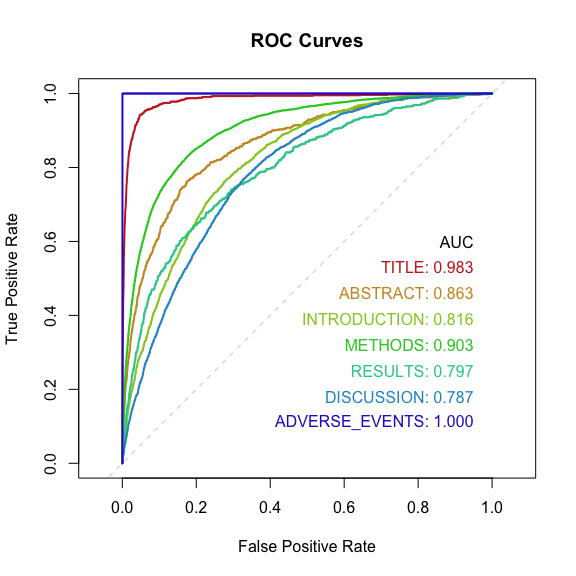
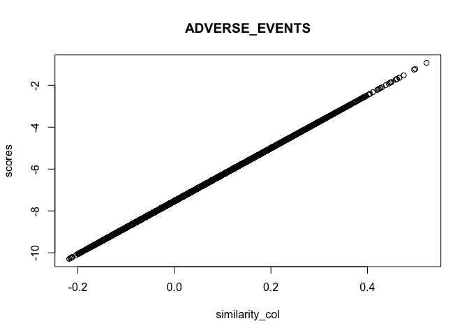

Training Classifiers on Section Heading Patterns
================
Bob
2024-04-22

## Using logistic regression classifier coefficients as a search vector

This document demonstrates two main points:

- Logistic regression text classifiers are useful and practical.
  - Semantic vectors make powerful predictive features features.
  - Labels mined from section headings can be used to identify a wide
    variety of topics.
- Model scoring can be framed as vector search.
  - We get the same ranking by vector similarity to the coefficient
    vector as we do from scoring with the model.

Database search is a theme here in that sometimes mined labels might
only apply to a small fraction of documents, so we need to search
through a large database of examples to find enough cases to supply
training and test sets.

``` r
library(dplyr)
library(ggplot2)
library(glmnet)
library(doMC)
library(ROCR)

DATA_DIR <- 'demo_data' # "/Volumes/UBUNTU\ 22_0/data/R_medicine/"

PRELIMINARY_MODELS_FILE <- "preliminary_models.Rds"

# Functions
plot_multiple_roc_curves <- function(sft_list){
  # sft_list: key=target name, value=dataframe with scores and flags
  targets = names(sft_list)
  colors <- rainbow(length(targets), end=2/3, s=0.8, v=0.8)
  plot(c(0,1), c(0,1), type='n', 
       xlab="False Positive Rate", ylab="True Positive Rate",
       main="ROC Curves", asp=1)
  abline(0, 1, col='lightgray', lty=2)
  text_x <- 0.95
  text_y <- 0.5
  text_step <- 0.07
  text(text_x, text_y, "AUC", adj=1)
  for (i in seq_along(targets)){
    target <- targets[[i]]
    sft <- sft_list[[target]]
    pred <- prediction(sft[['scores']], sft[['flags']])
    perf <- performance(pred, "tpr", "fpr")
    lines(perf@x.values[[1]], perf@y.values[[1]], lwd=2, col=colors[[i]])
    
    auc <- performance(pred, 'auc')@y.values[[1]]
    text(text_x, text_y - text_step * i, 
         sprintf("%s: %0.3f", target, auc),
         col=colors[[i]], adj=1)
    
  }
}

# pgvector functions from https://github.com/pgvector/pgvector-r/blob/master/dbx/example.R
pgvector.serialize <- function(v) {
  # stopifnot(is.numeric(v))
  paste0("[", paste(v, collapse=","), "]")
}

pgvector.unserialize <- function(v) {
  lapply(strsplit(substring(v, 2, nchar(v) - 1), ","), as.numeric)
}
```

``` r
training_set <- bind_rows(
  readRDS(file.path(DATA_DIR, 'data_sample_block_01.Rds'))
  , readRDS(file.path(DATA_DIR, 'data_sample_block_02.Rds'))
  , readRDS(file.path(DATA_DIR, 'data_sample_block_03.Rds'))
)

test_set <-  bind_rows(
  readRDS(file.path(DATA_DIR, 'data_sample_block_04.Rds'))
  , readRDS(file.path(DATA_DIR, 'data_sample_block_05.Rds'))
)

patterns <- list(
  TITLE = '^title$',
  METHODS = '.*methods',  # includes "Materials and Methods"
  RESULTS = 'results.*',  # includes "Results and Discussion"
  CONCLUSION = '^conclusion', # Any section path that starts with "Conclusion"
  DISCUSSION = 'discussion',  # includes "Results and Discussion"
  ADVERSE_EVENTS = '.*adverse.*' # any section path with the term 'adverse'.
)

X_train <- training_set[['vector']] %>% pgvector.unserialize %>% do.call('rbind', .)
X_test <- test_set[['vector']] %>% pgvector.unserialize %>% do.call('rbind', .)


flag_pattern <- function(pattern, text)
  pattern %>% grepl(text, ignore.case=TRUE) %>% as.numeric


flags_train <- patterns %>% lapply(flag_pattern, training_set[['section_path']]) %>% data.frame

flags_test <- patterns %>% lapply(flag_pattern, test_set[['section_path']]) %>% data.frame

cat("Positive cases in training set:")
```

    ## Positive cases in training set:

``` r
flags_train %>% colSums %>% print
```

    ##          TITLE        METHODS        RESULTS     CONCLUSION     DISCUSSION 
    ##           1315          10366          10251            702           8712 
    ## ADVERSE_EVENTS 
    ##             76

``` r
cat("Positive cases in test set:")
```

    ## Positive cases in test set:

``` r
flags_test %>% colSums %>% print
```

    ##          TITLE        METHODS        RESULTS     CONCLUSION     DISCUSSION 
    ##            865           6950           6627            422           5492 
    ## ADVERSE_EVENTS 
    ##              6

``` r
fit_model_for_pattern <- function(pattern_name)
  cv.glmnet(x=X_train, y=flags_train[[pattern_name]], family='binomial', alpha=0,
            type.measure='auc', nfolds=10, parallel=TRUE)

registerDoMC(cores = 10)


if (file.exists(PRELIMINARY_MODELS_FILE)){
  clf_list <- readRDS(PRELIMINARY_MODELS_FILE)
} else {
  clf_list <- names(patterns) %>% setNames(nm=.) %>% lapply(fit_model_for_pattern)
  saveRDS(clf_list, PRELIMINARY_MODELS_FILE)
}
```

``` r
# get scores as vector without dimnames
get_scores <- function(clf) predict(clf, newx=X_test)[,1] 

scores_test <- clf_list %>% lapply(get_scores) %>% as.data.frame

cor(scores_test)
```

    ##                      TITLE     METHODS     RESULTS CONCLUSION  DISCUSSION
    ## TITLE           1.00000000 -0.30620410 -0.28661895  0.3580097  0.14219867
    ## METHODS        -0.30620410  1.00000000 -0.11945433 -0.4699431 -0.59588284
    ## RESULTS        -0.28661895 -0.11945433  1.00000000 -0.1956303  0.26907407
    ## CONCLUSION      0.35800973 -0.46994315 -0.19563032  1.0000000  0.49277369
    ## DISCUSSION      0.14219867 -0.59588284  0.26907407  0.4927737  1.00000000
    ## ADVERSE_EVENTS -0.09717317 -0.02887599 -0.02583792  0.1441078  0.01976807
    ##                ADVERSE_EVENTS
    ## TITLE             -0.09717317
    ## METHODS           -0.02887599
    ## RESULTS           -0.02583792
    ## CONCLUSION         0.14410776
    ## DISCUSSION         0.01976807
    ## ADVERSE_EVENTS     1.00000000

``` r
scores_and_flags_for_target <- flags_test %>% 
  names %>% setNames(nm=.) %>% 
  lapply(function(nm) data.frame(target=nm, scores=scores_test[[nm]], flags=flags_test[[nm]]))


plot_multiple_roc_curves(scores_and_flags_for_target)
```

<!-- -->

If our pattern misses some examples (like “Results and Discussion” not
being counted as “Results” or “Discussion”, or if it is counted as both)
how would that affect our estimated classifier performance?

# Extract classifier parameters into a table.

``` r
get_parameter_row <- function(clf){
  vector_length <- function(v) sqrt(sum(v*v))
  
  par <- clf %>% coef %>% as.matrix %>% '['(,1)
  intercept <- par[[1]]
  beta <- par[-1]
  beta_length <- vector_length(beta)
  unit_beta_str <- (beta/beta_length) %>% pgvector.serialize
  list(intercept=intercept, beta_length=beta_length, unit_beta=unit_beta_str)
}


coef_df <- clf_list %>% lapply(get_parameter_row) %>% 
  bind_rows %>% bind_cols(target=names(clf_list), .)

coef_df %>% tibble
```

    ## # A tibble: 6 × 4
    ##   target         intercept beta_length unit_beta                                
    ##   <chr>              <dbl>       <dbl> <chr>                                    
    ## 1 TITLE              0.794        76.3 [-0.0467968675088471,0.0543109260168432,…
    ## 2 METHODS           -2.93         58.8 [0.0254973632440586,-0.0357027109599884,…
    ## 3 RESULTS           -3.13         75.3 [0.00580137097850468,0.0214862699839618,…
    ## 4 CONCLUSION        -3.77         49.2 [-0.008459392842157,0.038999205634204,0.…
    ## 5 DISCUSSION        -2.38         62.9 [-0.00598501116483947,0.0025424006295885…
    ## 6 ADVERSE_EVENTS    -7.53         12.7 [-0.0315081716056495,-0.0133998902956746…

# We can find the best matches using vector search instead of prediction

## Ranking by prediction

``` r
clf_name <- 'ADVERSE_EVENTS'
keep_cols <- c('pmid', 'paragraph_number', 'section_path', 'text')

top_by_prediction <- test_set[order(scores_test[[clf_name]], decreasing=TRUE), keep_cols] %>% head
knitr::kable(top_by_prediction, caption="Top matches by prediction")
```

|       | pmid     | paragraph_number | section_path                    | text                                                                                                                                                                                                                                                                                                                                                                                                                                                                                                                                                                                                                                                                                                                                                                                                                                                                                                                                      |
|:------|:---------|-----------------:|:--------------------------------|:------------------------------------------------------------------------------------------------------------------------------------------------------------------------------------------------------------------------------------------------------------------------------------------------------------------------------------------------------------------------------------------------------------------------------------------------------------------------------------------------------------------------------------------------------------------------------------------------------------------------------------------------------------------------------------------------------------------------------------------------------------------------------------------------------------------------------------------------------------------------------------------------------------------------------------------|
| 4511  | 29108368 |               16 | RESULTS \|\| Safety             | Hematologic toxicity was common, including anemia (n = 20, 100%), lymphopenia (n = 16, 80%), neutropenia (n = 15, 75%) and thrombocytopenia (n = 13, 65%). The most common non-hematologic toxicities included fatigue (n = 17, 85%), nausea (n = 13, 65%), hypocalcemia (n = 11, 55%), anorexia (n = 10, 50%) and paresthesias (n = 10, 50%). Regarding grade ≥ 3 AEs, the most common (≥ 10% of patients) grade 3 or 4 AEs observed were hematologic, including lymphopenia (n = 14, 70%), neutropenia (n = 12, 60%), anemia (n = 8, 40%) and thrombocytopenia (n = 5, 25%). Comparison of the incidence of grade ≥ 3 adverse events between patients who received up to three cycles of treatment vs. those that received more than three cycles showed there was only a statistically significant difference in the incidence of leukopenia (p = 0.03), with no difference observed in the incidence of other hematologic toxicities. |
| 25809 | 34712281 |               20 | METHODS \|\| Exclusion criteria | complications during pregnancy (such as thrombocytopenia during pregnancy, gestational diabetes, pregnancy anemia, intrahepatic cholestasis of pregnancy); previous hypertension, heart disease, diabetes, glaucoma, epilepsy, autoimmune disease; fetal growth restriction; severe bacterial or viral infectious diseases (upper respiratory infections, infectious diarrhea) in the last one month; taking immunosuppressants in the last six months.                                                                                                                                                                                                                                                                                                                                                                                                                                                                                   |
| 960   | 24596019 |               14 | Results \|\| Safety             | Four out of 22 (18 %) patients experienced at least one infusion-related reaction (IRR) at any time during the course of ERT (Supplementary Table 1). No other adverse events were observed.                                                                                                                                                                                                                                                                                                                                                                                                                                                                                                                                                                                                                                                                                                                                              |
| 4980  | 29625554 |               29 | Discussion                      | Studies which have included pregnancy termination data have found high rates of termination among women who have taken AEDs \[22, 23\]. One study found higher pregnancy termination rates among women taking AEDs compared with women not taking AEDs and found the rate of termination was particularly high among women taking AEDs for conditions other than epilepsy \[22\]. We included pregnancy termination data in this study and found a small but statistically significant decrease in the rate of pregnancy terminations in women who had been dispensed AEDs. There is a possibility that this rate is underestimated due to the termination data missing from private clinics.                                                                                                                                                                                                                                             |
| 1357  | 25146172 |               24 | Discussion                      | The overall incidence of miscarriages was not increased, and a slight but not statistically significant increase was observed only among women with no previous pregnancy. If the CIN treatment was subject to miscarriages, the incidence should be elevated regardless of pregnancy history.                                                                                                                                                                                                                                                                                                                                                                                                                                                                                                                                                                                                                                            |
| 4977  | 29625554 |               26 | Discussion                      | In this population based cohort study, we observed a higher rate of spontaneous abortion and lower rate of pregnancy termination in women who had been dispensed AEDs compared with women who had not been dispensed AEDs during pregnancy. There was also a statistically significant increase in the number of women of child-bearing age being dispensed AEDs over the study time period. Use of the sodium valproate declined over the time period while use of the newer generation AEDs, such as lamotrigine, increased. A similar trend was seen among women who were pregnant however this did not reach statistical significance. The majority of pregnant women dispensed AEDs during pregnancy are on monotherapy. With most prescriptions for AEDs in women of child-bearing potential provided by general practitioners.                                                                                                     |

Top matches by prediction

# Ranking by vector similarity

``` r
M_coef <- coef_df[['unit_beta']] %>% pgvector.unserialize %>% do.call('cbind', .)

vector_similarity <- X_test %*% M_coef

similarity_col <- vector_similarity[ , which(coef_df$target == clf_name)]
top_by_vector_similarity <- test_set[order(similarity_col, decreasing=TRUE), keep_cols] %>% head
knitr::kable(top_by_vector_similarity, caption="Top matches by vector similarity")
```

|       | pmid     | paragraph_number | section_path                    | text                                                                                                                                                                                                                                                                                                                                                                                                                                                                                                                                                                                                                                                                                                                                                                                                                                                                                                                                      |
|:------|:---------|-----------------:|:--------------------------------|:------------------------------------------------------------------------------------------------------------------------------------------------------------------------------------------------------------------------------------------------------------------------------------------------------------------------------------------------------------------------------------------------------------------------------------------------------------------------------------------------------------------------------------------------------------------------------------------------------------------------------------------------------------------------------------------------------------------------------------------------------------------------------------------------------------------------------------------------------------------------------------------------------------------------------------------|
| 4511  | 29108368 |               16 | RESULTS \|\| Safety             | Hematologic toxicity was common, including anemia (n = 20, 100%), lymphopenia (n = 16, 80%), neutropenia (n = 15, 75%) and thrombocytopenia (n = 13, 65%). The most common non-hematologic toxicities included fatigue (n = 17, 85%), nausea (n = 13, 65%), hypocalcemia (n = 11, 55%), anorexia (n = 10, 50%) and paresthesias (n = 10, 50%). Regarding grade ≥ 3 AEs, the most common (≥ 10% of patients) grade 3 or 4 AEs observed were hematologic, including lymphopenia (n = 14, 70%), neutropenia (n = 12, 60%), anemia (n = 8, 40%) and thrombocytopenia (n = 5, 25%). Comparison of the incidence of grade ≥ 3 adverse events between patients who received up to three cycles of treatment vs. those that received more than three cycles showed there was only a statistically significant difference in the incidence of leukopenia (p = 0.03), with no difference observed in the incidence of other hematologic toxicities. |
| 25809 | 34712281 |               20 | METHODS \|\| Exclusion criteria | complications during pregnancy (such as thrombocytopenia during pregnancy, gestational diabetes, pregnancy anemia, intrahepatic cholestasis of pregnancy); previous hypertension, heart disease, diabetes, glaucoma, epilepsy, autoimmune disease; fetal growth restriction; severe bacterial or viral infectious diseases (upper respiratory infections, infectious diarrhea) in the last one month; taking immunosuppressants in the last six months.                                                                                                                                                                                                                                                                                                                                                                                                                                                                                   |
| 960   | 24596019 |               14 | Results \|\| Safety             | Four out of 22 (18 %) patients experienced at least one infusion-related reaction (IRR) at any time during the course of ERT (Supplementary Table 1). No other adverse events were observed.                                                                                                                                                                                                                                                                                                                                                                                                                                                                                                                                                                                                                                                                                                                                              |
| 4980  | 29625554 |               29 | Discussion                      | Studies which have included pregnancy termination data have found high rates of termination among women who have taken AEDs \[22, 23\]. One study found higher pregnancy termination rates among women taking AEDs compared with women not taking AEDs and found the rate of termination was particularly high among women taking AEDs for conditions other than epilepsy \[22\]. We included pregnancy termination data in this study and found a small but statistically significant decrease in the rate of pregnancy terminations in women who had been dispensed AEDs. There is a possibility that this rate is underestimated due to the termination data missing from private clinics.                                                                                                                                                                                                                                             |
| 1357  | 25146172 |               24 | Discussion                      | The overall incidence of miscarriages was not increased, and a slight but not statistically significant increase was observed only among women with no previous pregnancy. If the CIN treatment was subject to miscarriages, the incidence should be elevated regardless of pregnancy history.                                                                                                                                                                                                                                                                                                                                                                                                                                                                                                                                                                                                                                            |
| 4977  | 29625554 |               26 | Discussion                      | In this population based cohort study, we observed a higher rate of spontaneous abortion and lower rate of pregnancy termination in women who had been dispensed AEDs compared with women who had not been dispensed AEDs during pregnancy. There was also a statistically significant increase in the number of women of child-bearing age being dispensed AEDs over the study time period. Use of the sodium valproate declined over the time period while use of the newer generation AEDs, such as lamotrigine, increased. A similar trend was seen among women who were pregnant however this did not reach statistical significance. The majority of pregnant women dispensed AEDs during pregnancy are on monotherapy. With most prescriptions for AEDs in women of child-bearing potential provided by general practitioners.                                                                                                     |

Top matches by vector similarity

``` r
scores <- scores_test[[clf_name]]
plot(similarity_col, scores, main=clf_name)
```

<!-- -->

To Do:

- Reproduce predicted probability using coefficients, intercept, scaling
  factor, and squashing function.
