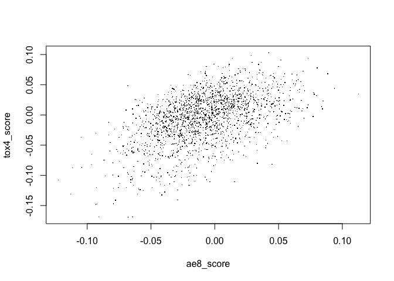

Mine ML labels from section heading paths
================
<rmhorton@win-vector.com>
2024-06-11

Here we revisit the ideas presented in the “mini-demo”
(`section_heading_pattern_demo.Rmd`), but using larger scale data
through connection to the Postgres database. Here are some of the core
SQL functions we use in this notebook:

    create or replace function fn_find_paragraphs_matching_pattern(pat_name varchar, pattern varchar) 
        returns table(pmid int, paragraph_number smallint, pattern_name text, section_path text) 
    as $$
      SELECT pmid, paragraph_number, pat_name, section_path AS pattern_name 
        FROM paragraph 
        WHERE lower(section_path) ~ pattern;
    $$ language sql;


    create or replace procedure proc_add_pattern(pat_name varchar, pat varchar) 
    as $$
        -- There can be only one pattern with a given name; replace if existing.
        DELETE FROM pattern_paragraph WHERE pattern_name = pat_name;
        DELETE FROM pattern_pmid WHERE pattern_name = pat_name;
        DELETE FROM pattern_name WHERE pattern_name = pat_name;
        
        -- Add results to these three tables:
        INSERT INTO pattern_paragraph 
            SELECT pmid, paragraph_number, pattern_name 
            FROM fn_find_paragraphs_matching_pattern(pat_name, pat);
        
        INSERT INTO pattern_pmid 
            SELECT pmid, pattern_name, count(*) tally, 
                    row_number() over (ORDER BY hashint8(pmid)) article_num
                FROM pattern_paragraph 
                WHERE pattern_name = pat_name 
                GROUP BY pmid, pattern_name;
        
        INSERT INTO pattern_name(pattern_name, pattern) values(pat_name, pat);
    $$ language sql;


    create or replace function fn_get_sample_dataset_for_pattern(
            par_pat_name varchar, par_num_subsets int, par_articles_per_subset int
        ) 
        returns table(
            pmid int, paragraph_number smallint, section_path text, 
            text text, vector vector, label text, article_num int, set_number int
        ) 
        parallel safe
        stable
    as $$
        -- Sample articles that have the pattern. The negative cases will be the paragraphs 
        -- in those same articles that do not have the pattern.
        with 
        articles as (
            select * from pattern_pmid 
              where pattern_name = par_pat_name
              limit (par_num_subsets * par_articles_per_subset)
        ),
        pp as (
          select * from pattern_paragraph
            where pattern_name = par_pat_name
        )
        select p.pmid, p.paragraph_number, p.section_path, p.text, e.vector, 
                case when pp.pattern_name is not null then 1 else 0 end as label, 
                a.article_num, mod(a.article_num, par_num_subsets)::int set_number
            from paragraph p 
            join articles a on p.pmid = a.pmid
            join embedding e on p.pmid = e.pmid and p.paragraph_number = e.paragraph_number
            left join pp on p.pmid = pp.pmid and p.paragraph_number = pp.paragraph_number

    $$ language sql;

## Connect to PostgreSQL

``` r
library(DBI)
library(jsonlite)
library(dplyr)
library(ROCR)
library(glmnet)
library(doParallel)
library(openxlsx)

registerDoParallel(8)

###
# pgvector functions from https://github.com/pgvector/pgvector-r/blob/master/dbx/example.R
pgvector.serialize <- function(v) {
  stopifnot(is.numeric(v))
  paste0("[", paste(v, collapse=","), "]")
}

pgvector.unserialize <- function(v) {
  lapply(strsplit(substring(v, 2, nchar(v) - 1), ","), as.numeric)
}
###

credentials <- as.list(fromJSON("credentials.json"))

con <- with(credentials, {
  DBI::dbConnect(RPostgres::Postgres(), dbname = dbname,
                 host = host, port = port,
                 user = user, password = password
)})

# dbGetQuery(con, "select tablename from pg_catalog.pg_tables where schemaname='public'")
```

``` r
dbGetQuery(con, "SELECT * FROM fn_find_paragraphs_matching_pattern('TOX3', 'results.*toxic') LIMIT 5")
```

    ##       pmid paragraph_number pattern_name
    ## 1 34884436                8         TOX3
    ## 2 34884723               13         TOX3
    ## 3 34443405               16         TOX3
    ## 4 34443405               17         TOX3
    ## 5 34443405               18         TOX3
    ##                                                                                                    section_path
    ## 1                                                        2. Results || 2.2. Toxicity Profile of ABT-123 in Rats
    ## 2 2. Results || 2.5. Single or Combined Checkpoint Blockade Increases NK-92 Cell-Mediated Cytotoxicity In Vitro
    ## 3                                 2. Results and Discussion || 2.7. Toxicological Performance Assay of Compound
    ## 4                                 2. Results and Discussion || 2.7. Toxicological Performance Assay of Compound
    ## 5                                 2. Results and Discussion || 2.7. Toxicological Performance Assay of Compound

``` r
# this will take a minute or so
```

## Define label patterns

We will do [pattern
matching](https://www.postgresql.org/docs/current/functions-matching.html)
in the database using POSIX regular expressions.

``` r
# https://www.postgresql.org/docs/current/functions-matching.html

patterns <- c(
    TITLE = '^title$',
    
    AE1 = 'adverse events',
    AE2 = 'adverse event',
    AE3 = 'adverse (event|effect)',
    AE4 = 'adverse.*(event|effect)',
    AE5 = 'results.*adverse.*(event|effect)',
    AE6 = 'results.*(adverse.*(event|effect)|tolerability)',
    AE7 = 'results.*(adverse (event|effect)|tolerability|safety)',
    AE8 = 'results.*(adverse.*(event|effect)|tolerability|safety)',
    AE9 = 'results.*(adverse.*(event|effect)|tolerability|safety|toxicit)',
    
    TOL = 'tolerability',
    
    SAFETY1 = 'safety',
    SAFETY2 = 'results.*safety',
    
    TOX1 = 'toxic',
    TOX2 = 'toxicit',
    TOX3 = 'results.*toxic',
    TOX4 = 'results.*toxicit',
    
    METHODS = 'methods',
    RESULTS = 'results'
)
```

``` r
pattern_name <- 'AE4'
pattern <- patterns[[pattern_name]]

sql <- sprintf("SELECT paragraph.*, '%s' as pattern_name FROM paragraph WHERE lower(section_path) ~ '%s' LIMIT 3", pattern_name, pattern)
dbGetQuery(con, sql)
```

## Find them all.

We call the procedure `proc_add_pattern` on each section heading
pattern, which finds all the paragraphs where each pattern occurs, keeps
track of the article PMIDs to which the paragraphs belong, and enters
the pattern by name in the patterns table. This process takes several
minutes.

``` r
for (pat_name in names(patterns)){
  pattern <- patterns[pat_name]
  sql <- sprintf("call proc_add_pattern('%s', '%s');", pat_name, pattern)
  print(sql)
  dbExecute(con, sql)
}
```

    ## [1] "call proc_add_pattern('TITLE', '^title$');"
    ## [1] "call proc_add_pattern('AE1', 'adverse events');"
    ## [1] "call proc_add_pattern('AE2', 'adverse event');"
    ## [1] "call proc_add_pattern('AE3', 'adverse (event|effect)');"
    ## [1] "call proc_add_pattern('AE4', 'adverse.*(event|effect)');"
    ## [1] "call proc_add_pattern('AE5', 'results.*adverse.*(event|effect)');"
    ## [1] "call proc_add_pattern('AE6', 'results.*(adverse.*(event|effect)|tolerability)');"
    ## [1] "call proc_add_pattern('AE7', 'results.*(adverse (event|effect)|tolerability|safety)');"
    ## [1] "call proc_add_pattern('AE8', 'results.*(adverse.*(event|effect)|tolerability|safety)');"
    ## [1] "call proc_add_pattern('AE9', 'results.*(adverse.*(event|effect)|tolerability|safety|toxicit)');"
    ## [1] "call proc_add_pattern('TOL', 'tolerability');"
    ## [1] "call proc_add_pattern('SAFETY1', 'safety');"
    ## [1] "call proc_add_pattern('SAFETY2', 'results.*safety');"
    ## [1] "call proc_add_pattern('TOX1', 'toxic');"
    ## [1] "call proc_add_pattern('TOX2', 'toxicit');"
    ## [1] "call proc_add_pattern('TOX3', 'results.*toxic');"
    ## [1] "call proc_add_pattern('TOX4', 'results.*toxicit');"
    ## [1] "call proc_add_pattern('METHODS', 'methods');"
    ## [1] "call proc_add_pattern('RESULTS', 'results');"

``` r
dbGetQuery(con, "select pattern_name, count(*) tally from pattern_paragraph group by pattern_name")
```

    ##    pattern_name    tally
    ## 1           AE1    21465
    ## 2           AE2    25165
    ## 3           AE3    34583
    ## 4           AE4    36877
    ## 5           AE5    16552
    ## 6           AE6    20460
    ## 7           AE7    53320
    ## 8           AE8    54298
    ## 9           AE9   117558
    ## 10      METHODS 17957580
    ## 11      RESULTS 18239331
    ## 12      SAFETY1   108383
    ## 13      SAFETY2    37558
    ## 14        STAT1  1504176
    ## 15        STAT2  1201934
    ## 16 STAT_METHOD1  1318929
    ## 17 STAT_METHOD2  1109052
    ## 18 STAT_RESULT1    66225
    ## 19 STAT_RESULT2    19761
    ## 20        TITLE  2253306
    ## 21          TOL     6348
    ## 22         TOX1   230464
    ## 23         TOX2   166630
    ## 24         TOX3    87799
    ## 25         TOX4    63945

``` r
PATTERN_MODELS_FILE <- "pattern_models_L2.Rds"

if (file.exists(PATTERN_MODELS_FILE)){
  model_list <- readRDS(PATTERN_MODELS_FILE)
} else {
  
  train_pattern_model <- function(pat_name){
    dset <- dbGetQuery(con, sprintf("select * from fn_get_sample_dataset_for_pattern('%s', 1, 500)", pat_name))
    
    X_train <- dset[['vector']] %>% pgvector.unserialize %>% do.call('rbind',.)
    X_train[abs(X_train) < 1e-5] <- 0.0 # really small values can randomly get huge coefficients (?!?)
    y_train <- dset[['label']] %>% as.numeric
    
    cv.glmnet(x=X_train, y=y_train, family="binomial", alpha=0, 
              type.measure="auc", parallel=TRUE)
  }
  
  model_list <- names(patterns) %>% setNames(nm=.) %>% lapply(train_pattern_model)
  
  saveRDS(model_list, PATTERN_MODELS_FILE)
}
```

Examples of section headings that match SAFETY2 = ‘results.*safety’ or
TOX3 = ’results.*toxic’

``` r
get_examples_for_pattern <- function(pattern_name, K=100){
  Q <- sprintf("with pp as 
  (select * from pattern_paragraph where pattern_name='%s' limit %d)
  select p.pmid, p.paragraph_number, p.section_path, p.text
    from paragraph p 
    join pp on p.pmid=pp.pmid and p.paragraph_number=pp.paragraph_number", pattern_name, K)
  dbGetQuery(con, Q)
}

pattern_examples <- list('SAFETY2', 'TOX3') %>% setNames(nm=.) %>% lapply(get_examples_for_pattern)

pattern_examples %>% tibble
```

    ## # A tibble: 2 × 1
    ##   .             
    ##   <named list>  
    ## 1 <df [100 × 4]>
    ## 2 <df [100 × 4]>

## Test models on hand-labelled SRD data

Even though each of these models was trained on a custom dataset, we
want to evaluate them on a common dataset to compare their performance.
We had domain experts and-label a set of sentences taking from existing
SRDs; the label we will use here is ‘ADVERSE_EVENTS’.

``` r
library(arrow)
```

    ## Some features are not enabled in this build of Arrow. Run `arrow_info()` for more information.

    ## The repository you retrieved Arrow from did not include all of Arrow's features.
    ## You can install a fully-featured version by running:
    ## `install.packages('arrow', repos = 'https://apache.r-universe.dev')`.

    ## 
    ## Attaching package: 'arrow'

    ## The following object is masked from 'package:utils':
    ## 
    ##     timestamp

``` r
test_data <- read_parquet("srd_test_data.parquet")
names(test_data) <- names(test_data) %>% gsub('_FLAG', '', .)

X_test <- test_data[['vector']] %>% do.call('rbind',.)
y_test <- test_data[["ADVERSE_EVENTS"]]

evaluate_model <- function(clf){
  scores <- predict(clf, X_test, s='lambda.1se')[,1]
  
  pred <- prediction(scores, y_test)
  roc_obj <- performance(pred, "tpr", "fpr")
  auc <- performance(pred, "auc")@y.values[[1]]
  list(auc=auc, roc_obj=roc_obj)
}

evaluation <- model_list %>% lapply(evaluate_model)

auc <- evaluation %>% sapply(function(x) x$auc)

model_comparison_df <- tibble( name=names(auc), pattern=patterns[names(auc)], auc=round(auc,5) )

model_comparison_df
```

    ## # A tibble: 19 × 3
    ##    name    pattern                                                          auc
    ##    <chr>   <chr>                                                          <dbl>
    ##  1 TITLE   ^title$                                                        0.461
    ##  2 AE1     adverse events                                                 0.833
    ##  3 AE2     adverse event                                                  0.843
    ##  4 AE3     adverse (event|effect)                                         0.840
    ##  5 AE4     adverse.*(event|effect)                                        0.844
    ##  6 AE5     results.*adverse.*(event|effect)                               0.847
    ##  7 AE6     results.*(adverse.*(event|effect)|tolerability)                0.855
    ##  8 AE7     results.*(adverse (event|effect)|tolerability|safety)          0.864
    ##  9 AE8     results.*(adverse.*(event|effect)|tolerability|safety)         0.861
    ## 10 AE9     results.*(adverse.*(event|effect)|tolerability|safety|toxicit) 0.859
    ## 11 TOL     tolerability                                                   0.851
    ## 12 SAFETY1 safety                                                         0.829
    ## 13 SAFETY2 results.*safety                                                0.865
    ## 14 TOX1    toxic                                                          0.833
    ## 15 TOX2    toxicit                                                        0.830
    ## 16 TOX3    results.*toxic                                                 0.833
    ## 17 TOX4    results.*toxicit                                               0.819
    ## 18 METHODS methods                                                        0.418
    ## 19 RESULTS results                                                        0.745

## Extract model data

``` r
get_parameter_row <- function(clf){
  vector_length <- function(v) sqrt(sum(v*v))
  
  par <- clf %>% coef(s='lambda.1se') %>% as.matrix %>% '['(,1)
  intercept <- par[[1]]
  beta <- par[-1]
  beta_length <- vector_length(beta)
  beta_unit_str <- (beta/beta_length) %>% pgvector.serialize
  list(intercept=intercept, beta_scaling_factor=beta_length, beta_unit_vector=beta_unit_str)
}

model_data <- model_list %>% lapply(get_parameter_row) %>% 
  bind_rows %>% bind_cols(target=names(model_list), .)
```

## Search for the most different examples between two models

Here we find examples of paragraphs that have a higher score for the
TOX4 model than they do for the AE8 model. A plot comparing the scores
for these two models for a large number of paragraphs gives an idea of
how well these scores correlate with one another.

``` r
scored_paragraphs_sql <- sprintf("with concept_vectors(name, vector) as (
  values
  ('%s', '%s'),
  ('%s', '%s')
),
cv as (
  select cast(name as text) as name, cast(vector as vector(768)) as vector from concept_vectors
),
scored_examples as (
  select pmid, paragraph_number
      , vector <#> (select vector from cv where name='AE8') as AE8_score
      , vector <#> (select vector from cv where name='TOX4') as TOX4_score
    from embedding 
    limit 2000
)
select se.*, p.section_path, p.text
  from scored_examples se
  join paragraph p on se.pmid=p.pmid and se.paragraph_number=p.paragraph_number
", 
"AE8", model_data[model_data$target=="AE8",][["beta_unit_vector"]],
"TOX4", model_data[model_data$target=="TOX4",][["beta_unit_vector"]])

scored_paragraphs <- dbGetQuery(con, scored_paragraphs_sql)

with(scored_paragraphs, plot(ae8_score, tox4_score, pch='.'))
```

<!-- -->

``` r
tox4_minus_ae8 <- scored_paragraphs %>% arrange(tox4_score - ae8_score) %>% head(20)
```

# Write tables to spreadsheet

It is easier to examine the text of these examples if we write them to a
spreadsheet.

``` r
list(
    pattern_examples=pattern_examples,
    model_comparison=model_comparison_df, 
    model_data=model_data, 
    tox4_minus_ae8=tox4_minus_ae8
  )  %>%
  write.xlsx("section_heading_patterns_results.xlsx")
```
